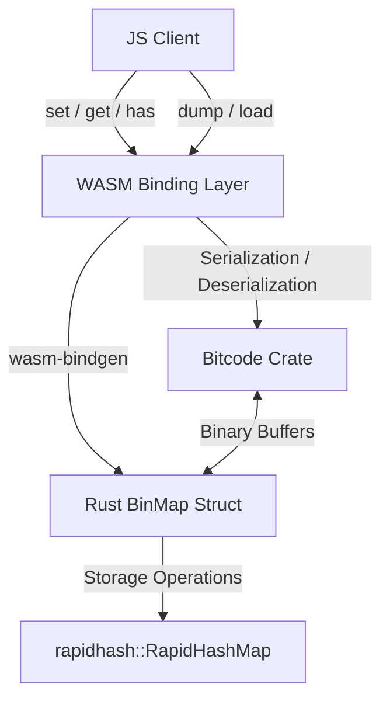
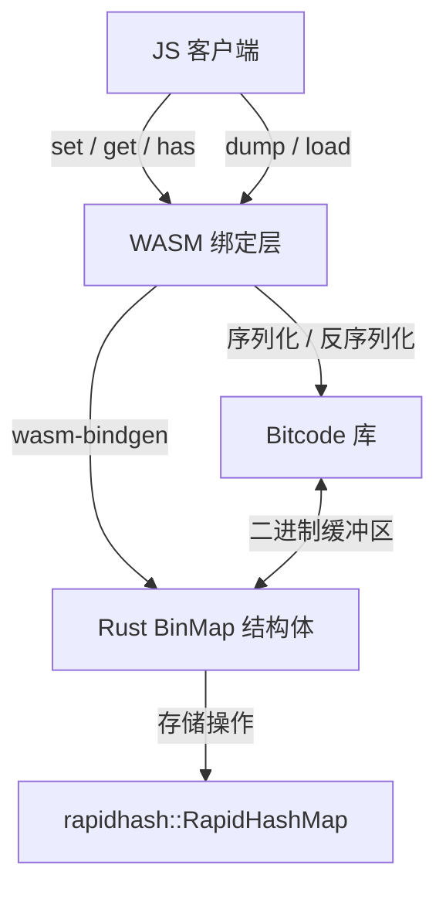

# @3-/binmap

[English](#en) | [中文](#zh)

---

<a id="en"></a>
# BinMap : WebAssembly binary key-value map based on Rust RapidHashMap

WebAssembly binary key-value map implementation. Built with Rust RapidHashMap, serialized using Bitcode, and compiled to WebAssembly.

## Table of Contents

- [Features](#features)
- [Tech Stack](#tech-stack)
- [Directory Structure](#directory-structure)
- [Design Architecture](#design-architecture)
- [Usage Demo](#usage-demo)
- [API Reference](#api-reference)
- [Historical Anecdote](#historical-anecdote)

## Features

- **High Performance Storage**: Employs `rapidhash` for fast in-memory key-value lookups.
- **Serialization**: Uses Bitcode binary serialization for extremely fast and compact map dumping and loading.
- **WebAssembly Engine**: Runs in Node.js and browser environments at native-like speeds.
- **Binary Interface**: Operates directly on Uint8Array buffers without character encoding overhead.

## Tech Stack

- **Core Language**: Rust (2024 edition)
- **Hashing**: Rapidhash (1.4)
- **Serialization**: Bitcode (0.6)
- **WASM Interface**: wasm-bindgen (0.2.122)
- **Optimization**: wasm-opt (O3 optimization)

## Directory Structure

```text
.
├── Cargo.toml            # Rust cargo package configuration
├── build.sh              # WebAssembly compilation script
├── package.json          # npm package configuration
├── run.sh                # Test runner script
├── src
│   └── lib.rs            # Rust library implementation code
└── test.js               # JS test demo file
```

## Design Architecture

The following diagram illustrates the call flow and component relationships:



## Usage Demo

Example written in CoffeeScript:

```coffee
#!/usr/bin/env coffee

> ./pkg/_ > BinMap

m = new BinMap

# Insert binary keys and values
m.set(
  new Uint8Array(1)
  new Uint8Array([1,2,3])
)

m.set new Uint8Array([5]), new Uint8Array [5,6]

# Dump map to serialized binary, then reload
m = BinMap.load m.dump()

# Query keys
console.log(
  m.get(
    new Uint8Array(1)
  )
)
console.log m.size
```

## API Reference

### `BinMap` Class

- `constructor()`: Initializes empty BinMap.
- `set(key: Uint8Array, val: Uint8Array): void`: Inserts or updates key-value pair.
- `get(key: Uint8Array): Uint8Array | undefined`: Returns value associated with key, or undefined if not found.
- `has(key: Uint8Array): boolean`: Returns boolean indicating key presence.
- `dump(): Uint8Array`: Serializes entire map into Uint8Array buffer.
- `static load(bin: Uint8Array): BinMap`: Instantiates new map from serialized buffer.
- `readonly size: number`: Returns total key-value pairs.

## Historical Anecdote

The underlying core data structure is based on `rapidhash`, which is the official successor to `wyhash`. `wyhash` and `rapidhash` are among the fastest quality-assured non-cryptographic hash functions, consistently passing SMHasher and SMHasher3 benchmarks. The name `rapidhash` is derived from its main goal: delivering exceptional execution speeds across diverse platforms.

---

<a id="zh"></a>
# BinMap : 基于 Rust RapidHashMap 的 WebAssembly 二进制键值映射表

二进制键值映射表实现。基于 Rust RapidHashMap，配合 Bitcode 序列化，编译为 WebAssembly。

## 目录

- [功能特性](#功能特性)
- [技术栈](#技术栈)
- [目录结构](#目录结构)
- [设计思路与架构](#设计思路与架构)
- [使用演示](#使用演示)
- [API 说明](#api-说明)
- [历史小故事](#历史小故事)

## 功能特性

- **高性能存储**：使用 `rapidhash`，提供极快内存键值检索。
- **序列化**：使用 Bitcode 二进制序列化，加速数据导出与导入，且生成的数据极度紧凑。
- **WebAssembly 运行**：支持 Node.js 及浏览器环境，运行效率高。
- **二进制接口**：直接操作 Uint8Array，避免字符编码转换开销。

## 技术栈

- **核心语言**：Rust (2024 edition)
- **哈希算法**：Rapidhash (1.4)
- **序列化库**：Bitcode (0.6)
- **WASM 接口**：wasm-bindgen (0.2.122)
- **体积优化**：wasm-opt (O3 优化)

## 目录结构

```text
.
├── Cargo.toml            # Rust 项目配置
├── build.sh              # WebAssembly 编译脚本
├── package.json          # npm 包配置
├── run.sh                # 测试运行脚本
├── src
│   └── lib.rs            # Rust 库源码
└── test.js               # JS 测试演示
```

## 设计思路与架构

下图展示模块调用关系与数据流动：



## 使用演示

CoffeeScript 演示代码如下：

```coffee
#!/usr/bin/env coffee

> ./pkg/_ > BinMap

m = new BinMap

# 插入键值对
m.set(
  new Uint8Array(1)
  new Uint8Array([1,2,3])
)

m.set new Uint8Array([5]), new Uint8Array [5,6]

# 序列化导出并重新加载
m = BinMap.load m.dump()

# 查询键值
console.log(
  m.get(
    new Uint8Array(1)
  )
)
console.log m.size
```

## API 说明

### `BinMap` 类

- `constructor()`：初始化空映射表。
- `set(key: Uint8Array, val: Uint8Array): void`：插入或更新键值对。
- `get(key: Uint8Array): Uint8Array | undefined`：获取键对应值，未找到返回 `undefined`。
- `has(key: Uint8Array): boolean`：判断键是否存在。
- `dump(): Uint8Array`：将映射表序列化为 Uint8Array 缓冲区。
- `static load(bin: Uint8Array): BinMap`：从二进制缓冲区反序列化并构建 BinMap。
- `readonly size: number`：返回键值对总数。

## 历史小故事

映射表核心数据结构基于 `rapidhash`。`rapidhash` 是目前最快的非加密哈希算法之一 `wyhash` 的官方继承者，在 SMHasher 和 SMHasher3 基准测试中表现优异，全部测试均顺利通过。它的名字 `rapidhash` 来源于其主要设计目标：在各种主流硬件平台上提供极致的执行速度。

---

## About

This project is an open-source component of [i18n.site ⋅ Internationalization Solution](https://i18n.site).

- [i18 : MarkDown Command Line Translation Tool](https://i18n.site/i18)

  The translation perfectly maintains the Markdown format.

  It recognizes file changes and only translates the modified files.

  The translated Markdown content is editable; if you modify the original text and translate it again, manually edited translations will not be overwritten (as long as the original text has not been changed).

- [i18n.site : MarkDown Multi-language Static Site Generator](https://i18n.site/i18n.site)

  Optimized for a better reading experience

## 关于

本项目为 [i18n.site ⋅ 国际化解决方案](https://i18n.site) 的开源组件。

- [i18 : MarkDown命令行翻译工具](https://i18n.site/i18)

  翻译能够完美保持 Markdown 的格式。能识别文件的修改，仅翻译有变动的文件。

  Markdown 翻译内容可编辑；如果你修改原文并再次机器翻译，手动修改过的翻译不会被覆盖（如果这段原文没有被修改）。

- [i18n.site : MarkDown多语言静态站点生成器](https://i18n.site/i18n.site) 为阅读体验而优化。
