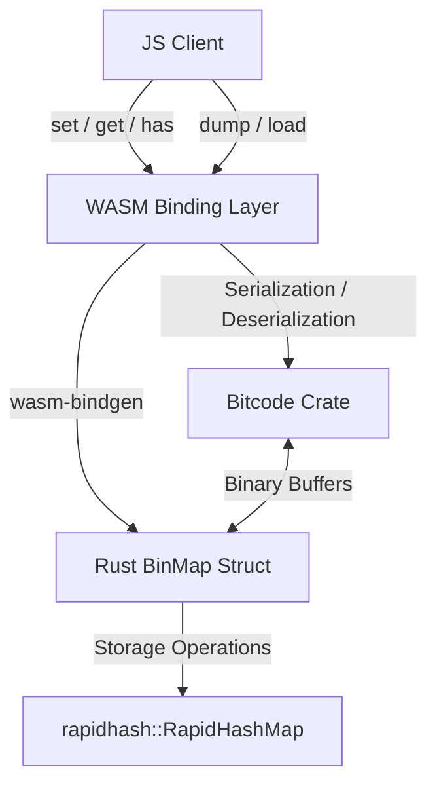

# BinMap : WebAssembly binary key-value map based on Rust RapidHashMap

WebAssembly binary key-value map implementation. Built with Rust RapidHashMap, serialized using Bitcode, and compiled to WebAssembly.

## Table of Contents

- [Features](#features)
- [Tech Stack](#tech-stack)
- [Directory Structure](#directory-structure)
- [Design Architecture](#design-architecture)
- [Usage Demo](#usage-demo)
- [API Reference](#api-reference)
- [Historical Anecdote](#historical-anecdote)

## Features

- **High Performance Storage**: Employs `rapidhash` for fast in-memory key-value lookups.
- **Serialization**: Uses Bitcode binary serialization for extremely fast and compact map dumping and loading.
- **WebAssembly Engine**: Runs in Node.js and browser environments at native-like speeds.
- **Binary Interface**: Operates directly on Uint8Array buffers without character encoding overhead.

## Tech Stack

- **Core Language**: Rust (2024 edition)
- **Hashing**: Rapidhash (1.4)
- **Serialization**: Bitcode (0.6)
- **WASM Interface**: wasm-bindgen (0.2.122)
- **Optimization**: wasm-opt (O3 optimization)

## Directory Structure

```text
.
├── Cargo.toml            # Rust cargo package configuration
├── build.sh              # WebAssembly compilation script
├── package.json          # npm package configuration
├── run.sh                # Test runner script
├── src
│   └── lib.rs            # Rust library implementation code
└── test.js               # JS test demo file
```

## Design Architecture

The following diagram illustrates the call flow and component relationships:



## Usage Demo

Example written in CoffeeScript:

```coffee
#!/usr/bin/env coffee

> ./pkg/_ > BinMap

m = new BinMap

# Insert binary keys and values
m.set(
  new Uint8Array(1)
  new Uint8Array([1,2,3])
)

m.set new Uint8Array([5]), new Uint8Array [5,6]

# Dump map to serialized binary, then reload
m = BinMap.load m.dump()

# Query keys
console.log(
  m.get(
    new Uint8Array(1)
  )
)
console.log m.size
```

## API Reference

### `BinMap` Class

- `constructor()`: Initializes empty BinMap.
- `set(key: Uint8Array, val: Uint8Array): void`: Inserts or updates key-value pair.
- `get(key: Uint8Array): Uint8Array | undefined`: Returns value associated with key, or undefined if not found.
- `has(key: Uint8Array): boolean`: Returns boolean indicating key presence.
- `dump(): Uint8Array`: Serializes entire map into Uint8Array buffer.
- `static load(bin: Uint8Array): BinMap`: Instantiates new map from serialized buffer.
- `readonly size: number`: Returns total key-value pairs.

## Historical Anecdote

The underlying core data structure is based on `rapidhash`, which is the official successor to `wyhash`. `wyhash` and `rapidhash` are among the fastest quality-assured non-cryptographic hash functions, consistently passing SMHasher and SMHasher3 benchmarks. The name `rapidhash` is derived from its main goal: delivering exceptional execution speeds across diverse platforms.
