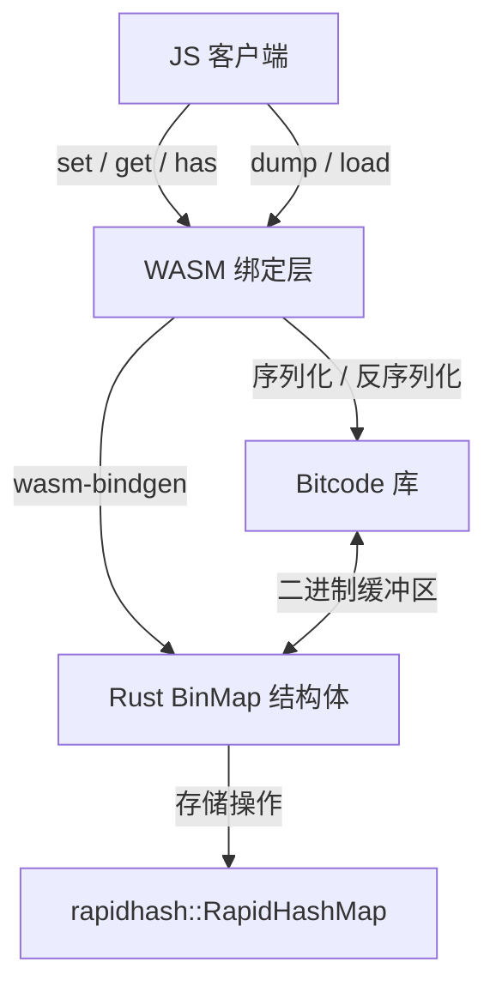

# BinMap : 基于 Rust RapidHashMap 的 WebAssembly 二进制键值映射表

二进制键值映射表实现。基于 Rust RapidHashMap，配合 Bitcode 序列化，编译为 WebAssembly。

## 目录

- [功能特性](#功能特性)
- [技术栈](#技术栈)
- [目录结构](#目录结构)
- [设计思路与架构](#设计思路与架构)
- [使用演示](#使用演示)
- [API 说明](#api-说明)
- [历史小故事](#历史小故事)

## 功能特性

- **高性能存储**：使用 `rapidhash`，提供极快内存键值检索。
- **序列化**：使用 Bitcode 二进制序列化，加速数据导出与导入，且生成的数据极度紧凑。
- **WebAssembly 运行**：支持 Node.js 及浏览器环境，运行效率高。
- **二进制接口**：直接操作 Uint8Array，避免字符编码转换开销。

## 技术栈

- **核心语言**：Rust (2024 edition)
- **哈希算法**：Rapidhash (1.4)
- **序列化库**：Bitcode (0.6)
- **WASM 接口**：wasm-bindgen (0.2.122)
- **体积优化**：wasm-opt (O3 优化)

## 目录结构

```text
.
├── Cargo.toml            # Rust 项目配置
├── build.sh              # WebAssembly 编译脚本
├── package.json          # npm 包配置
├── run.sh                # 测试运行脚本
├── src
│   └── lib.rs            # Rust 库源码
└── test.js               # JS 测试演示
```

## 设计思路与架构

下图展示模块调用关系与数据流动：



## 使用演示

CoffeeScript 演示代码如下：

```coffee
#!/usr/bin/env coffee

> ./pkg/_ > BinMap

m = new BinMap

# 插入键值对
m.set(
  new Uint8Array(1)
  new Uint8Array([1,2,3])
)

m.set new Uint8Array([5]), new Uint8Array [5,6]

# 序列化导出并重新加载
m = BinMap.load m.dump()

# 查询键值
console.log(
  m.get(
    new Uint8Array(1)
  )
)
console.log m.size
```

## API 说明

### `BinMap` 类

- `constructor()`：初始化空映射表。
- `set(key: Uint8Array, val: Uint8Array): void`：插入或更新键值对。
- `get(key: Uint8Array): Uint8Array | undefined`：获取键对应值，未找到返回 `undefined`。
- `has(key: Uint8Array): boolean`：判断键是否存在。
- `dump(): Uint8Array`：将映射表序列化为 Uint8Array 缓冲区。
- `static load(bin: Uint8Array): BinMap`：从二进制缓冲区反序列化并构建 BinMap。
- `readonly size: number`：返回键值对总数。

## 历史小故事

映射表核心数据结构基于 `rapidhash`。`rapidhash` 是目前最快的非加密哈希算法之一 `wyhash` 的官方继承者，在 SMHasher 和 SMHasher3 基准测试中表现优异，全部测试均顺利通过。它的名字 `rapidhash` 来源于其主要设计目标：在各种主流硬件平台上提供极致的执行速度。
