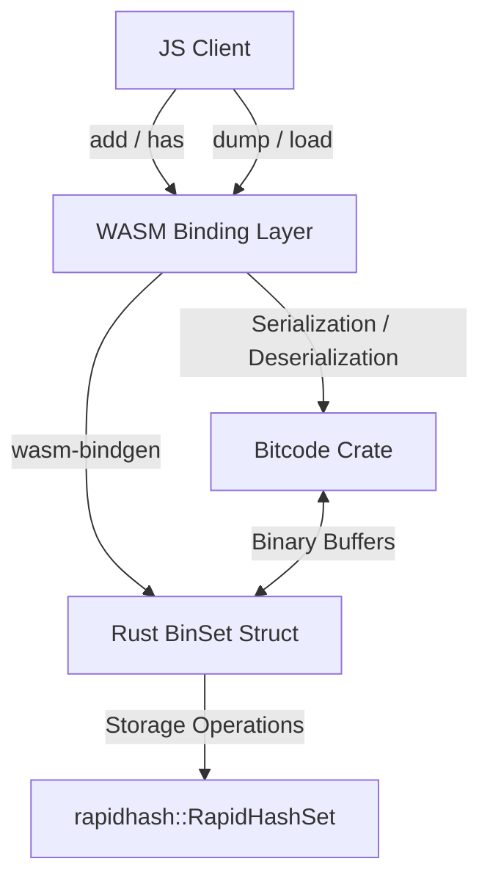
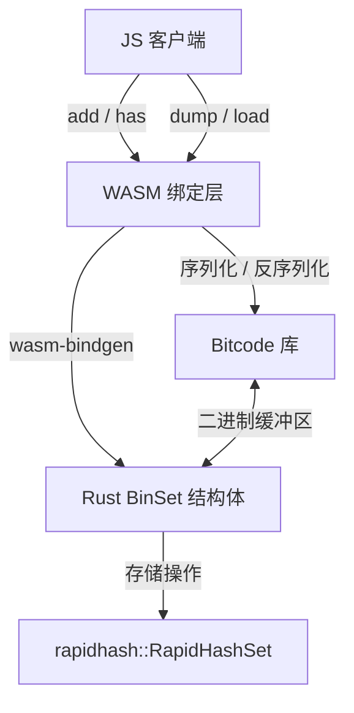

# @3-/binset

[English](#en) | [中文](#zh)

---

<a id="en"></a>
# BinSet : WebAssembly binary set based on Rust HashSet (rapidhash)

WebAssembly binary set implementation. Built with Rust HashSet (using rapidhash), serialized using Bitcode, and compiled to WebAssembly.

## Table of Contents

- [Features](#features)
- [Tech Stack](#tech-stack)
- [Directory Structure](#directory-structure)
- [Design Architecture](#design-architecture)
- [Usage Demo](#usage-demo)
- [API Reference](#api-reference)
- [Historical Anecdote](#historical-anecdote)

## Features

- **High-Performance Storage**: Employs `RapidHashSet` (based on `rapidhash`) to achieve fast, $O(1)$ binary set operations.
- **Serialization**: Uses Bitcode binary serialization for extremely compact and fast set dumping and loading.
- **WebAssembly Engine**: Runs in Node.js and browser environments at native-like speeds.
- **Binary Interface**: Operates directly on Uint8Array buffers without character encoding overhead.

## Tech Stack

- **Core Language**: Rust (2024 edition)
- **Hashing Algorithm**: rapidhash (4.4.1)
- **Serialization**: Bitcode (0.6.9)
- **WASM Interface**: wasm-bindgen (0.2.122)
- **Optimization**: wasm-opt (O3 optimization)

## Directory Structure

```text
.
├── Cargo.toml            # Rust cargo package configuration
├── build.sh              # WebAssembly compilation script
├── package.json          # npm package configuration
├── run.sh                # Test runner script
├── src
│   └── lib.rs            # Rust library implementation code
└── test.js               # JS test demo file
```

## Design Architecture

The following diagram illustrates the call flow and component relationships:



## Usage Demo

Example written in CoffeeScript:

```coffee
#!/usr/bin/env coffee

> ./pkg/_ > BinSet

s = new BinSet

# Insert binary values
s.add(
  new Uint8Array(1)
)

s.add new Uint8Array([5])

# Dump set to serialized binary, then reload
s = BinSet.load s.dump()

# Query values
console.log(
  s.has(
    new Uint8Array(1)
  )
)
console.log s.size
```

## API Reference

### `BinSet` Class

- `constructor()`: Initializes empty BinSet.
- `add(val: Uint8Array): void`: Inserts value.
- `has(val: Uint8Array): boolean`: Returns boolean indicating value presence.
- `dump(): Uint8Array`: Serializes entire set into Uint8Array buffer.
- `static load(bin: Uint8Array): BinSet`: Instantiates new set from serialized buffer.
- `readonly size: number`: Returns total elements.

## Historical Anecdote

The underlying hashing algorithm is rapidhash, the official successor to the famous wyhash non-cryptographic hash function. Wyhash was originally authored by Wang Yi. rapidhash was developed to push performance even further on modern CPUs while fully passing the rigorous SMHasher and SMHasher3 test suites for collision resistance and statistical quality.

---

<a id="zh"></a>
# BinSet : 基于 Rust HashSet (rapidhash) 的 WebAssembly 二进制集合

二进制集合实现。基于 Rust HashSet（使用 rapidhash 算法），配合 Bitcode 序列化，编译为 WebAssembly。

## 目录

- [功能特性](#功能特性)
- [技术栈](#技术栈)
- [目录结构](#目录结构)
- [设计思路与架构](#设计思路与架构)
- [使用演示](#使用演示)
- [API 说明](#api-说明)
- [历史小故事](#历史小故事)

## 功能特性

- **高性能存储**：使用 `RapidHashSet`（基于 `rapidhash`），实现快速的 $O(1)$ 二进制集合操作。
- **序列化**：使用 Bitcode 序列化协议，实现极度紧凑且快速的数据导出与导入。
- **WebAssembly 运行**：支持 Node.js 及浏览器环境，运行效率高。
- **二进制接口**：直接操作 Uint8Array，避免字符编码转换开销。

## 技术栈

- **核心语言**：Rust (2024 edition)
- **哈希算法**：rapidhash (4.4.1)
- **序列化库**：Bitcode (0.6.9)
- **WASM 接口**：wasm-bindgen (0.2.122)
- **体积优化**：wasm-opt (O3 优化)

## 目录结构

```text
.
├── Cargo.toml            # Rust 项目配置
├── build.sh              # WebAssembly 编译脚本
├── package.json          # npm 包配置
├── run.sh                # 测试运行脚本
├── src
│   └── lib.rs            # Rust 库源码
└── test.js               # JS 测试演示
```

## 设计思路与架构

下图展示模块调用关系与数据流动：



## 使用演示

CoffeeScript 演示代码如下：

```coffee
#!/usr/bin/env coffee

> ./pkg/_ > BinSet

s = new BinSet

# 插入二进制值
s.add(
  new Uint8Array(1)
)

s.add new Uint8Array([5])

# 序列化导出并重新加载
s = BinSet.load s.dump()

# 查询值
console.log(
  s.has(
    new Uint8Array(1)
  )
)
console.log s.size
```

## API 说明

### `BinSet` 类

- `constructor()`：初始化空集合。
- `add(val: Uint8Array): void`：插入值。
- `has(val: Uint8Array): boolean`：判断值是否存在。
- `dump(): Uint8Array`：将集合序列化为 Uint8Array 缓冲区。
- `static load(bin: Uint8Array): BinSet`：从二进制缓冲区反序列化并构建 BinSet。
- `readonly size: number`：返回集合内元素总数。

## 历史小故事

底层哈希算法 rapidhash 是著名的非加密哈希算法 wyhash 的官方继承者。wyhash 最初由王一（Wang Yi）设计。rapidhash 的开发旨在进一步提升在现代 CPU 上的性能表现，同时完全通过了严格的 SMHasher 和 SMHasher3 哈希碰撞与质量测试套件。

---

## About

This project is an open-source component of [i18n.site ⋅ Internationalization Solution](https://i18n.site).

* [i18 : MarkDown Command Line Translation Tool](https://i18n.site/i18)

  The translation perfectly maintains the Markdown format.

  It recognizes file changes and only translates the modified files.

  The translated Markdown content is editable; if you modify the original text and translate it again, manually edited translations will not be overwritten (as long as the original text has not been changed).

* [i18n.site : MarkDown Multi-language Static Site Generator](https://i18n.site/i18n.site)

  Optimized for a better reading experience

## 关于

本项目为 [i18n.site ⋅ 国际化解决方案](https://i18n.site) 的开源组件。

* [i18 :  MarkDown命令行翻译工具](https://i18n.site/i18)

  翻译能够完美保持 Markdown 的格式。能识别文件的修改，仅翻译有变动的文件。

  Markdown 翻译内容可编辑；如果你修改原文并再次机器翻译，手动修改过的翻译不会被覆盖（如果这段原文没有被修改）。

* [i18n.site : MarkDown多语言静态站点生成器](https://i18n.site/i18n.site) 为阅读体验而优化。
