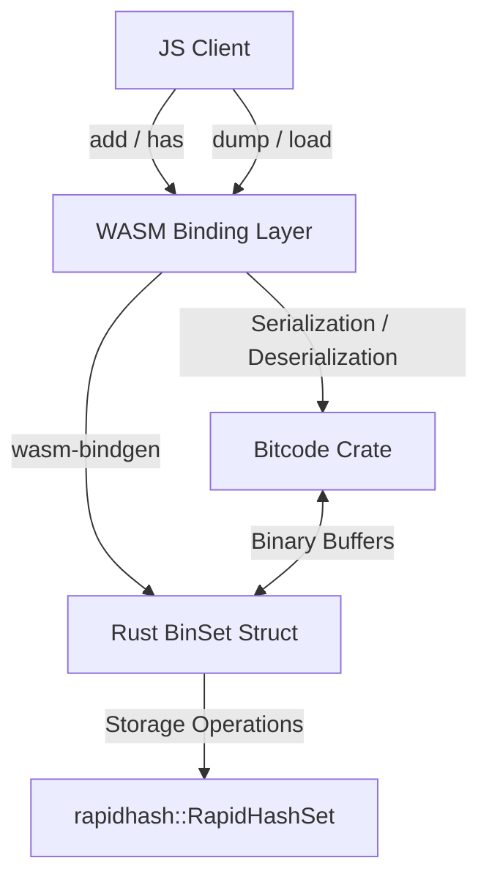

# BinSet : WebAssembly binary set based on Rust HashSet (rapidhash)

WebAssembly binary set implementation. Built with Rust HashSet (using rapidhash), serialized using Bitcode, and compiled to WebAssembly.

## Table of Contents

- [Features](#features)
- [Tech Stack](#tech-stack)
- [Directory Structure](#directory-structure)
- [Design Architecture](#design-architecture)
- [Usage Demo](#usage-demo)
- [API Reference](#api-reference)
- [Historical Anecdote](#historical-anecdote)

## Features

- **High-Performance Storage**: Employs `RapidHashSet` (based on `rapidhash`) to achieve fast, $O(1)$ binary set operations.
- **Serialization**: Uses Bitcode binary serialization for extremely compact and fast set dumping and loading.
- **WebAssembly Engine**: Runs in Node.js and browser environments at native-like speeds.
- **Binary Interface**: Operates directly on Uint8Array buffers without character encoding overhead.

## Tech Stack

- **Core Language**: Rust (2024 edition)
- **Hashing Algorithm**: rapidhash (4.4.1)
- **Serialization**: Bitcode (0.6.9)
- **WASM Interface**: wasm-bindgen (0.2.122)
- **Optimization**: wasm-opt (O3 optimization)

## Directory Structure

```text
.
├── Cargo.toml            # Rust cargo package configuration
├── build.sh              # WebAssembly compilation script
├── package.json          # npm package configuration
├── run.sh                # Test runner script
├── src
│   └── lib.rs            # Rust library implementation code
└── test.js               # JS test demo file
```

## Design Architecture

The following diagram illustrates the call flow and component relationships:



## Usage Demo

Example written in CoffeeScript:

```coffee
#!/usr/bin/env coffee

> ./pkg/_ > BinSet

s = new BinSet

# Insert binary values
s.add(
  new Uint8Array(1)
)

s.add new Uint8Array([5])

# Dump set to serialized binary, then reload
s = BinSet.load s.dump()

# Query values
console.log(
  s.has(
    new Uint8Array(1)
  )
)
console.log s.size
```

## API Reference

### `BinSet` Class

- `constructor()`: Initializes empty BinSet.
- `add(val: Uint8Array): void`: Inserts value.
- `has(val: Uint8Array): boolean`: Returns boolean indicating value presence.
- `dump(): Uint8Array`: Serializes entire set into Uint8Array buffer.
- `static load(bin: Uint8Array): BinSet`: Instantiates new set from serialized buffer.
- `readonly size: number`: Returns total elements.

## Historical Anecdote

The underlying hashing algorithm is rapidhash, the official successor to the famous wyhash non-cryptographic hash function. Wyhash was originally authored by Wang Yi. rapidhash was developed to push performance even further on modern CPUs while fully passing the rigorous SMHasher and SMHasher3 test suites for collision resistance and statistical quality.
