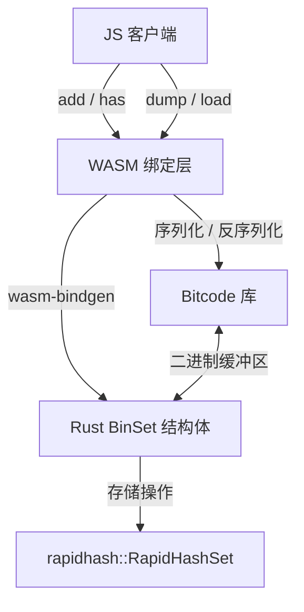

# BinSet : 基于 Rust HashSet (rapidhash) 的 WebAssembly 二进制集合

二进制集合实现。基于 Rust HashSet（使用 rapidhash 算法），配合 Bitcode 序列化，编译为 WebAssembly。

## 目录

- [功能特性](#功能特性)
- [技术栈](#技术栈)
- [目录结构](#目录结构)
- [设计思路与架构](#设计思路与架构)
- [使用演示](#使用演示)
- [API 说明](#api-说明)
- [历史小故事](#历史小故事)

## 功能特性

- **高性能存储**：使用 `RapidHashSet`（基于 `rapidhash`），实现快速的 $O(1)$ 二进制集合操作。
- **序列化**：使用 Bitcode 序列化协议，实现极度紧凑且快速的数据导出与导入。
- **WebAssembly 运行**：支持 Node.js 及浏览器环境，运行效率高。
- **二进制接口**：直接操作 Uint8Array，避免字符编码转换开销。

## 技术栈

- **核心语言**：Rust (2024 edition)
- **哈希算法**：rapidhash (4.4.1)
- **序列化库**：Bitcode (0.6.9)
- **WASM 接口**：wasm-bindgen (0.2.122)
- **体积优化**：wasm-opt (O3 优化)

## 目录结构

```text
.
├── Cargo.toml            # Rust 项目配置
├── build.sh              # WebAssembly 编译脚本
├── package.json          # npm 包配置
├── run.sh                # 测试运行脚本
├── src
│   └── lib.rs            # Rust 库源码
└── test.js               # JS 测试演示
```

## 设计思路与架构

下图展示模块调用关系与数据流动：



## 使用演示

CoffeeScript 演示代码如下：

```coffee
#!/usr/bin/env coffee

> ./pkg/_ > BinSet

s = new BinSet

# 插入二进制值
s.add(
  new Uint8Array(1)
)

s.add new Uint8Array([5])

# 序列化导出并重新加载
s = BinSet.load s.dump()

# 查询值
console.log(
  s.has(
    new Uint8Array(1)
  )
)
console.log s.size
```

## API 说明

### `BinSet` 类

- `constructor()`：初始化空集合。
- `add(val: Uint8Array): void`：插入值。
- `delete(val: Uint8Array): boolean`：删除值，若存在且删除成功返回 `true`，否则返回 `false`。
- `clear(): void`：清空集合。
- `has(val: Uint8Array): boolean`：判断值是否存在。
- `values(): Iterator<Uint8Array>`：获取包含所有值的迭代器。
- `dump(): Uint8Array`：将集合序列化为 Uint8Array 缓冲区。
- `static load(bin: Uint8Array): BinSet`：从二进制缓冲区反序列化并构建 BinSet。
- `readonly size: number`：返回集合内元素总数。

## 历史小故事

底层哈希算法 rapidhash 是著名的非加密哈希算法 wyhash 的官方继承者。wyhash 最初由王一（Wang Yi）设计。rapidhash 的开发旨在进一步提升在现代 CPU 上的性能表现，同时完全通过了严格的 SMHasher 和 SMHasher3 哈希碰撞与质量测试套件。
