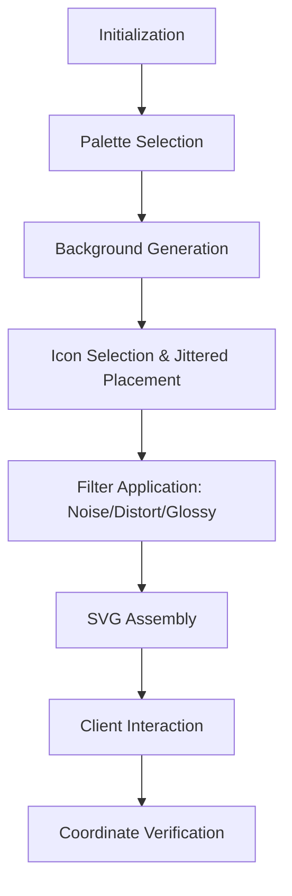
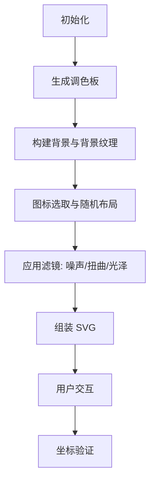

# @3-/tmpl

[English](#en) | [中文](#zh)

---

<a id="en"></a>
# @3-/captcha : Lightweight Click-based SVG CAPTCHA Generator

[English](en.md) | [简体中文](zh.md)

- [Introduction](#introduction)
- [Features](#features)
- [Tech Stack](#tech-stack)
- [Usage](#usage)
- [Architecture](#architecture)
- [Directory Structure](#directory-structure)
- [Trivia](#trivia)

## Introduction

`@3-/captcha` provides high-performance, dependency-free SVG CAPTCHA generation. It produces click-based challenges for user identification. Output consists of pure SVG, ensuring resolution independence and seamless integration.

## Features

- **Pure SVG Output**: Scalable vector graphics without bitmap assets.
- **Security Enhancements**: Dynamic noise, distortion filters, and wave overlays to resist automated solvers.
- **Visual Diversity**: Random color palettes, glossy/shadow effects, and jittered grid placement.
- **Configurable**: Adjustable dimensions and target counts.
- **Verification**: Built-in coordinate validation logic.

## Tech Stack

- **Runtime**: JavaScript (ESM).
- **Graphics**: SVG (XML).
- **Optimization**: SVGO.

## Usage

### Generation

```javascript
import captchaGen from "@3-/captcha";

// Returns [svgString, targetIcons, positions]
const [svg, targets, positions] = captchaGen(300, 300, 3);
```

### Verification

```javascript
import verify from "@3-/captcha/verify";

const userClicks = [[45, 60], [120, 30]]; // User click coordinates
const isValid = verify(userClicks, positions);
```

## Architecture

The following diagram illustrates the CAPTCHA generation and verification flow:



## Directory Structure

- `src/`: Core implementation logic.
- `pattern/`: Vector patterns for background textures.
- `svg/`: Source icon library.
- `tests/`: Examples and test cases.
- `lib/`: Optimized distribution files.

## Trivia

The term **CAPTCHA** stands for "Completely Automated Public Turing test to tell Computers and Humans Apart." It was coined in 2003 by Luis von Ahn and his team at Carnegie Mellon University. 

Interestingly, CAPTCHAs have served dual purposes over the years. The **reCAPTCHA** project utilized human efforts to digitize the entire archive of *The New York Times* and millions of books from Google Books by presenting words that OCR software failed to recognize. Today, when you identify traffic lights or crosswalks in a CAPTCHA, you are likely helping train AI models for autonomous vehicles.

---

<a id="zh"></a>
# @3-/captcha : 轻量级点选式 SVG 验证码生成器

[English](en.md) | [简体中文](zh.md)

- [简介](#简介)
- [特性](#特性)
- [技术堆栈](#技术堆栈)
- [使用演示](#使用演示)
- [设计思路](#设计思路)
- [目录结构](#目录结构)
- [趣味历史](#趣味历史)

## 简介

`@3-/captcha` 提供高性能、无依赖的 SVG 验证码生成功能。其生成点选式挑战，用于识别用户。输出结果为纯 SVG 格式，确保分辨率无关性，方便集成。

## 特性

- **纯 SVG 输出**: 无位图资源，轻量且可无限缩放。
- **安全性增强**: 动态噪声、扭曲滤镜及波动叠加，抵御自动化攻击。
- **视觉丰富**: 随机调色板、光泽/阴影效果及抖动网格布局。
- **高度可定制**: 支持自定义画布尺寸及目标数量。
- **坐标验证**: 内置边界框验证逻辑。

## 技术堆栈

- **运行时**: JavaScript (ESM)。
- **图形**: SVG (XML)。
- **优化**: SVGO。

## 使用演示

### 生成验证码

```javascript
import captchaGen from "@3-/captcha";

// 返回 [svg字符串, 目标图标列表, 位置信息]
const [svg, targets, positions] = captchaGen(300, 300, 3);
```

### 验证点击

```javascript
import verify from "@3-/captcha/verify";

const userClicks = [[45, 60], [120, 30]]; // 用户点击坐标
const isValid = verify(userClicks, positions);
```

## 设计思路

以下流程图展示了验证码的生成与验证流程：



## 目录结构

- `src/`: 核心逻辑实现。
- `pattern/`: 用于背景纹理的矢量模式。
- `svg/`: 基础图标库。
- `tests/`: 演示示例与测试用例。
- `lib/`: 优化后的分发文件。

## 趣味历史

**CAPTCHA** 全称为“全自动区分计算机和人类的公开图灵测试”。这一概念由 Luis von Ahn 及其团队于 2003 年在卡内基梅隆大学提出。

有趣的是，验证码在多年间一直承担着双重使命。**reCAPTCHA** 项目曾利用人类的识别过程，帮助数字化了《纽约时报》的全部存档以及 Google 图书中的数百万册书籍——这些书籍中的词汇是 OCR 软件无法识别的。如今，当你识别验证码中的红绿灯或斑马线时，你很可能正在为自动驾驶汽车训练 AI 模型。

---

## About

This project is an open-source component of [i18n.site ⋅ Internationalization Solution](https://i18n.site).

* [i18 : MarkDown Command Line Translation Tool](https://i18n.site/i18)

  The translation perfectly maintains the Markdown format.

  It recognizes file changes and only translates the modified files.

  The translated Markdown content is editable; if you modify the original text and translate it again, manually edited translations will not be overwritten (as long as the original text has not been changed).

* [i18n.site : MarkDown Multi-language Static Site Generator](https://i18n.site/i18n.site)

  Optimized for a better reading experience

## 关于

本项目为 [i18n.site ⋅ 国际化解决方案](https://i18n.site) 的开源组件。

* [i18 :  MarkDown命令行翻译工具](https://i18n.site/i18)

  翻译能够完美保持 Markdown 的格式。能识别文件的修改，仅翻译有变动的文件。

  Markdown 翻译内容可编辑；如果你修改原文并再次机器翻译，手动修改过的翻译不会被覆盖（如果这段原文没有被修改）。

* [i18n.site : MarkDown多语言静态站点生成器](https://i18n.site/i18n.site) 为阅读体验而优化。
