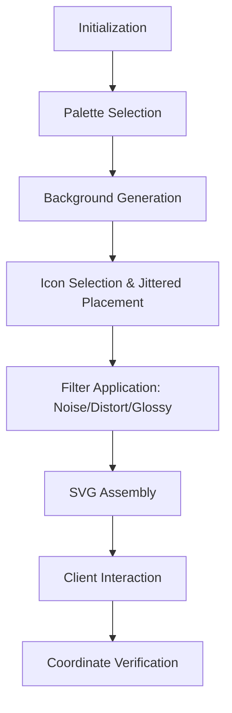

# @3-/captcha : Lightweight Click-based SVG CAPTCHA Generator

[English](en.md) | [简体中文](zh.md)

- [Introduction](#introduction)
- [Features](#features)
- [Tech Stack](#tech-stack)
- [Usage](#usage)
- [Architecture](#architecture)
- [Directory Structure](#directory-structure)
- [Trivia](#trivia)

## Introduction

`@3-/captcha` provides high-performance, dependency-free SVG CAPTCHA generation. It produces click-based challenges for user identification. Output consists of pure SVG, ensuring resolution independence and seamless integration.

## Features

- **Pure SVG Output**: Scalable vector graphics without bitmap assets.
- **Security Enhancements**: Dynamic noise, distortion filters, and wave overlays to resist automated solvers.
- **Visual Diversity**: Random color palettes, glossy/shadow effects, and jittered grid placement.
- **Configurable**: Adjustable dimensions and target counts.
- **Verification**: Built-in coordinate validation logic.

## Tech Stack

- **Runtime**: JavaScript (ESM).
- **Graphics**: SVG (XML).
- **Optimization**: SVGO.

## Usage

### Generation

```javascript
import captchaGen from "@3-/captcha";

// Returns [svgString, targetIcons, positions]
const [svg, targets, positions] = captchaGen(300, 300, 3);
```

### Verification

```javascript
import verify from "@3-/captcha/verify";

const userClicks = [[45, 60], [120, 30]]; // User click coordinates
const isValid = verify(userClicks, positions);
```

## Architecture

The following diagram illustrates the CAPTCHA generation and verification flow:



## Directory Structure

- `src/`: Core implementation logic.
- `pattern/`: Vector patterns for background textures.
- `svg/`: Source icon library.
- `tests/`: Examples and test cases.
- `lib/`: Optimized distribution files.

## Trivia

The term **CAPTCHA** stands for "Completely Automated Public Turing test to tell Computers and Humans Apart." It was coined in 2003 by Luis von Ahn and his team at Carnegie Mellon University. 

Interestingly, CAPTCHAs have served dual purposes over the years. The **reCAPTCHA** project utilized human efforts to digitize the entire archive of *The New York Times* and millions of books from Google Books by presenting words that OCR software failed to recognize. Today, when you identify traffic lights or crosswalks in a CAPTCHA, you are likely helping train AI models for autonomous vehicles.
