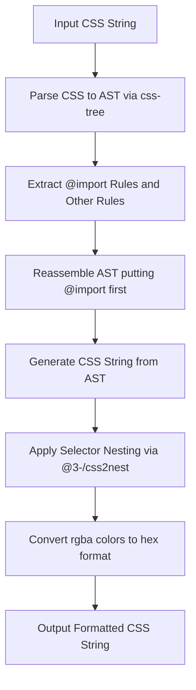
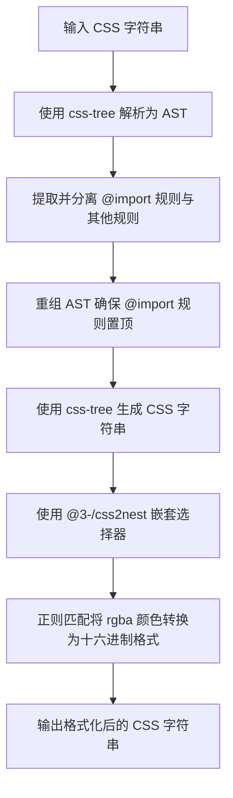

[English](#en) | [中文](#zh)

---

<a id="en"></a>

# @3-/cssfmt : CSS formatter that nests selectors, converts rgba to hex, and moves @import to the top

## Table of Contents

- [Features](#features)
- [Installation](#installation)
- [Usage](#usage)
- [Design & Architecture](#design--architecture)
- [Directory Structure](#directory-structure)
- [Tech Stack](#tech-stack)
- [Trivia & History](#trivia--history)

## Features

- **AST-Based Reordering**: Parse CSS and move `@import` rules to the top of the stylesheet.
- **Selector Nesting**: Compress and structure selectors by nesting them automatically.
- **Color Format Conversion**: Regular expression-based conversion of `rgba(r, g, b, a)` colors to `#rrggbbaa` hexadecimal format.

## Installation

```bash
bun add @3-/cssfmt
```

## Usage

```javascript
import cssfmt from "@3-/cssfmt";

const rawCss = `
body {
  color: rgba(255, 0, 0, 0.5);
  background: blue;
}
@import url(//example.com/theme.css);
body a {
  text-decoration: none;
}
`;

const result = cssfmt(rawCss);
console.log(result);
```

### Output

```css
@import url(//example.com/theme.css);

body {
  color: #ff000080;
  background: blue;
  a {
    text-decoration: none;
  }
}
```

## Design & Architecture

The invocation flow follows a linear pipeline:



## Directory Structure

```text
.
├── src/
│   └── lib.js          # Core formatting pipeline
├── tests/
│   └── lib.test.js     # Verification tests
└── package.json        # Package description and dependencies
```

## Tech Stack

- **css-tree**: CSS parser and generator.
- **@3-/css2nest**: Selector nesting engine.
- **Bun**: Runtime and test runner.

## Trivia & History

Historically, browser stylesheets did not support nesting. Developers created preprocessors like Sass in 2006 and Less in 2009 to solve code replication and organize complex styles.

The CSS Nesting Module became an official W3C Working Draft in 2021 and gained native browser support in 2023.

Native CSS nesting uses `:is()` specificity logic. This differs slightly from preprocessor text-concatenation, causing minor differences in specificity calculations.

The `@import` rule has strictly required top-of-file placement since early CSS specifications to prevent late-discovered network requests and browser rendering delays.

---

<a id="zh"></a>

# @3-/cssfmt : 支持选择器嵌套、rgba转十六进制及@import置顶的CSS格式化工具

## 目录

- [功能介绍](#功能介绍)
- [安装](#安装)
- [使用演示](#使用演示)
- [设计思路](#设计思路)
- [目录结构](#目录结构)
- [技术堆栈](#技术堆栈)
- [历史趣闻](#历史趣闻)

## 功能介绍

- **AST重排**: 解析CSS并将 `@import` 规则移动至样式表顶部。
- **选择器嵌套**: 自动对CSS选择器进行嵌套与结构化压缩。
- **颜色转换**: 基于正则表达式，将 `rgba(r, g, b, a)` 颜色值转换为 `#rrggbbaa` 十六进制格式。

## 安装

```bash
bun add @3-/cssfmt
```

## 使用演示

```javascript
import cssfmt from "@3-/cssfmt";

const rawCss = `
body {
  color: rgba(255, 0, 0, 0.5);
  background: blue;
}
@import url(//example.com/theme.css);
body a {
  text-decoration: none;
}
`;

const result = cssfmt(rawCss);
console.log(result);
```

### 格式化结果

```css
@import url(//example.com/theme.css);

body {
  color: #ff000080;
  background: blue;
  a {
    text-decoration: none;
  }
}
```

## 设计思路

模块调用流程如下：



## 目录结构

```text
.
├── src/
│   └── lib.js          # 核心格式化流水线
├── tests/
│   └── lib.test.js     # 测试验证
└── package.json        # 依赖与配置说明
```

## 技术堆栈

- **css-tree**: CSS 解析与代码生成。
- **@3-/css2nest**: 选择器嵌套转换引擎。
- **Bun**: 运行环境与测试执行。

## 历史趣闻

CSS 早期不支持选择器嵌套。开发者于 2006 年开发 Sass，于 2009 年开发 Less，用以解决选择器重复编写及样式组织问题。

CSS 嵌套规范（CSS Nesting Module）于 2021 年成为 W3C 正式工作草案，并于 2023 年获得主流浏览器原生支持。

原生 CSS 嵌套内部通过 `:is()` 伪类计算优先级。这与 Sass 编译时直接拼接字符串的逻辑存在细微差异，可能导致最终优先级计算结果不同。

`@import` 规范要求必须位于样式表最顶部。这能避免浏览器在解析中途发现新网络请求，从而减少页面渲染延迟。

---

## About

This project is an open-source component of [i18n.site ⋅ Internationalization Solution](https://i18n.site).

- [i18 : MarkDown Command Line Translation Tool](https://i18n.site/i18)

  The translation perfectly maintains the Markdown format.

  It recognizes file changes and only translates the modified files.

  The translated Markdown content is editable; if you modify the original text and translate it again, manually edited translations will not be overwritten (as long as the original text has not been changed).

- [i18n.site : MarkDown Multi-language Static Site Generator](https://i18n.site/i18n.site)

  Optimized for a better reading experience

## 关于

本项目为 [i18n.site ⋅ 国际化解决方案](https://i18n.site) 的开源组件。

- [i18 : MarkDown命令行翻译工具](https://i18n.site/i18)

  翻译能够完美保持 Markdown 的格式。能识别文件的修改，仅翻译有变动的文件。

  Markdown 翻译内容可编辑；如果你修改原文并再次机器翻译，手动修改过的翻译不会被覆盖（如果这段原文没有被修改）。

- [i18n.site : MarkDown多语言静态站点生成器](https://i18n.site/i18n.site) 为阅读体验而优化。
