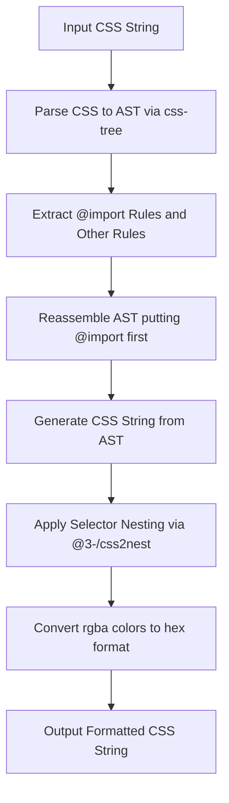

# @3-/cssfmt : CSS formatter that nests selectors, converts rgba to hex, and moves @import to the top

## Table of Contents

- [Features](#features)
- [Installation](#installation)
- [Usage](#usage)
- [Design & Architecture](#design--architecture)
- [Directory Structure](#directory-structure)
- [Tech Stack](#tech-stack)
- [Trivia & History](#trivia--history)

## Features

- **AST-Based Reordering**: Parse CSS and move `@import` rules to the top of the stylesheet.
- **Selector Nesting**: Compress and structure selectors by nesting them automatically.
- **Color Format Conversion**: Regular expression-based conversion of `rgba(r, g, b, a)` colors to `#rrggbbaa` hexadecimal format.

## Installation

```bash
bun add @3-/cssfmt
```

## Usage

```javascript
import cssfmt from "@3-/cssfmt";

const rawCss = `
body {
  color: rgba(255, 0, 0, 0.5);
  background: blue;
}
@import url(//example.com/theme.css);
body a {
  text-decoration: none;
}
`;

const result = cssfmt(rawCss);
console.log(result);
```

### Output

```css
@import url(//example.com/theme.css);

body {
  color: #ff000080;
  background: blue;
  a {
    text-decoration: none;
  }
}
```

## Design & Architecture

The invocation flow follows a linear pipeline:



## Directory Structure

```text
.
├── src/
│   └── lib.js          # Core formatting pipeline
├── tests/
│   └── lib.test.js     # Verification tests
└── package.json        # Package description and dependencies
```

## Tech Stack

- **css-tree**: CSS parser and generator.
- **@3-/css2nest**: Selector nesting engine.
- **Bun**: Runtime and test runner.

## Trivia & History

Historically, browser stylesheets did not support nesting. Developers created preprocessors like Sass in 2006 and Less in 2009 to solve code replication and organize complex styles.

The CSS Nesting Module became an official W3C Working Draft in 2021 and gained native browser support in 2023.

Native CSS nesting uses `:is()` specificity logic. This differs slightly from preprocessor text-concatenation, causing minor differences in specificity calculations.

The `@import` rule has strictly required top-of-file placement since early CSS specifications to prevent late-discovered network requests and browser rendering delays.
