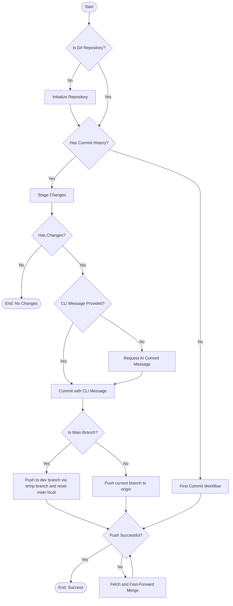
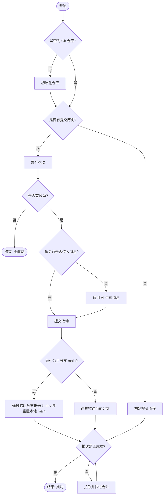

[English](#en) | [中文](#zh)

---

<a id="en"></a>

# @3-/gci : AI-Powered Git Commit and Push Automation Tool

## Table of Contents

- [Features](#features)
- [Installation](#installation)
- [Usage](#usage)
- [Configuration](#configuration)
- [Architecture and Design](#architecture-and-design)
- [Tech Stack](#tech-stack)
- [Directory Structure](#directory-structure)
- [History and Anecdotes](#history-and-anecdotes)

## Features

- Automates staging of modifications (`git add .`).
- Generates commit messages based on diff outputs using AI.
- Supports custom commit messages provided through command line arguments.
- Protects default branch (`main`) by redirecting direct pushes to development branch (`dev`) via temporary branches.
- Handles push conflicts automatically by executing fetch, fast-forward merge, and retry operations.

## Installation

```bash
bun i -D @3-/gci
```

## Usage

Run tool in directory containing Git repository:

```bash
bunx gci
```

Or specify commit message directly:

```bash
bunx gci "feat: add new feature"
```

## Configuration

You can customize the behavior using the following environment variables:

- `GCI_PROMPT`: Customize the prompt used to generate the AI commit message.
- `NO_PUSH`: If set (e.g. `NO_PUSH=1`), the tool will only commit changes locally and will not push them to the remote repository.

## Architecture and Design

The tool executes workflow sequentially:

1. Verifies repository status. Initializes repository if non-existent.
2. Checks commit history.
3. If no commit history exists, executes first commit workflow.
4. If commit history exists:
   - Stages all current modifications.
   - Computes differences.
   - Obtains commit message via AI client or command line arguments.
   - Commits changes.
   - Pushes commits to remote origin based on branch policies.

### Module Invocation Flow



## Tech Stack

- **Runtime**: Node.js / Bun
- **Git client**: `simple-git`
- **AI integration**: `@opencode-ai/sdk`
- **Console styling**: `ansis`
- **Logging**: `@3-/log`

## Directory Structure

```
.
├── src/
│   ├── ai.js      # AI client initialization and message generation
│   ├── gci.js     # CLI entry point
│   └── lib.js     # Core workflow logic (repository detection, committing, pushing, branch policy)
└── tests/
    └── gci.test.js # Test suite
```

## History and Anecdotes

Git was created by Linus Torvalds in 2005 to manage the development of Linux kernel. The historic initial commit made on April 7, 2005, had commit message:

> _"Initial revision of "git", the information manager from hell"_

Developers often write cryptic messages under pressure. Software engineer John F. Woods famously suggested:

> _"Always code as if the guy who ends up maintaining your code will be a violent psychopath who knows where you live."_

This principle applies to git commit messages. Clear history prevents future maintenance issues. Automated tools standardizing commit history resolve clarity problems.

---

<a id="zh"></a>

# @3-/gci : AI 驱动的 Git 提交与推送自动化工具

## 目录

- [功能特性](#功能特性)
- [安装](#安装)
- [使用说明](#使用说明)
- [配置说明](#配置说明)
- [架构设计与模块流程](#架构设计与模块流程)
- [技术堆栈](#技术堆栈)
- [目录结构](#目录结构)
- [历史与轶事](#历史与轶事)

## 功能特性

- 自动暂存改动（`git add .`）。
- 依据代码差异（Diff）自动调用 AI 生成规范的提交消息。
- 支持命令行参数传入自定义提交消息。
- 保护默认分支（`main`），通过临时分支将提交推送到远程开发分支（`dev`）。
- 自动处理推送冲突，执行拉取、快进合并与重新推送。

## 安装

```bash
bun i -D @3-/gci
```

## 使用说明

在 Git 仓库目录运行：

```bash
bunx gci
```

或者指定提交消息：

```bash
bunx gci "feat: 增加新功能"
```

## 配置说明

您可以通过以下环境变量来自定义行为：

- `GCI_PROMPT`: 自定义用于生成 AI 提交消息的提示词。
- `NO_PUSH`: 如果设置该变量（如 `NO_PUSH=1`），工具只会执行本地提交，不会推送到远程仓库。

## 架构设计与模块流程

系统按顺序执行以下流程：

1. 校验仓库状态。若非 Git 仓库，则执行初始化。
2. 检查提交历史。
3. 若无提交历史，执行初始提交流程。
4. 若有提交历史：
   - 暂存改动并计算差异。
   - 检查是否有变动，无变动则退出。
   - 获取提交消息（优先使用命令行参数，其次调用 AI 客户端生成）。
   - 提交改动。
   - 根据分支策略执行推送。

### 模块调用流程图



## 技术堆栈

- **运行环境**: Node.js / Bun
- **Git 客户端**: `simple-git`
- **AI 集成**: `@opencode-ai/sdk`
- **终端样式**: `ansis`
- **日志工具**: `@3-/log`

## 目录结构

```
.
├── src/
│   ├── ai.js      # AI 客户端初始化与提交消息生成
│   ├── gci.js     # 命令行入口
│   └── lib.js     # 核心流程逻辑（仓库检测、提交、推送、分支保护）
└── tests/
    └── gci.test.js # 测试套件
```

## 历史与轶事

Git 由 Linus Torvalds 于 2005 年创立，用于管理 Linux 内核开发。2005 年 4 月 7 日，Linus 提交了 Git 仓库的初始版本，其提交消息写道：

> _"Initial revision of "git", the information manager from hell"_

开发者在紧急修改代码时往往会写下难以理解的提交日志。软件工程师 John F. Woods 曾提出著名建议：

> _"写代码时要时刻设想，维护你代码的人是掌握你家庭住址的暴躁精神病患者。"_

该建议同样适用于 Git 提交日志。清晰的提交历史能规避后期维护隐患。采用工具自动化、规范化生成提交日志，有助于提升团队协作效率。

---

## About

This project is an open-source component of [i18n.site ⋅ Internationalization Solution](https://i18n.site).

- [i18 : MarkDown Command Line Translation Tool](https://i18n.site/i18)

  The translation perfectly maintains the Markdown format.

  It recognizes file changes and only translates the modified files.

  The translated Markdown content is editable; if you modify the original text and translate it again, manually edited translations will not be overwritten (as long as the original text has not been changed).

- [i18n.site : MarkDown Multi-language Static Site Generator](https://i18n.site/i18n.site)

  Optimized for a better reading experience

## 关于

本项目为 [i18n.site ⋅ 国际化解决方案](https://i18n.site) 的开源组件。

- [i18 : MarkDown命令行翻译工具](https://i18n.site/i18)

  翻译能够完美保持 Markdown 的格式。能识别文件的修改，仅翻译有变动的文件。

  Markdown 翻译内容可编辑；如果你修改原文并再次机器翻译，手动修改过的翻译不会被覆盖（如果这段原文没有被修改）。

- [i18n.site : MarkDown多语言静态站点生成器](https://i18n.site/i18n.site) 为阅读体验而优化。
