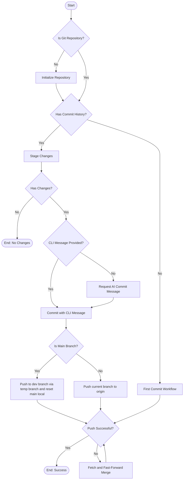

# @3-/gci : AI-Powered Git Commit and Push Automation Tool

## Table of Contents
- [Features](#features)
- [Installation](#installation)
- [Usage](#usage)
- [Configuration](#configuration)
- [Architecture and Design](#architecture-and-design)
- [Tech Stack](#tech-stack)
- [Directory Structure](#directory-structure)
- [History and Anecdotes](#history-and-anecdotes)

## Features
- Automates staging of modifications (`git add .`).
- Generates commit messages based on diff outputs using AI.
- Supports custom commit messages provided through command line arguments.
- Protects default branch (`main`) by redirecting direct pushes to development branch (`dev`) via temporary branches.
- Handles push conflicts automatically by executing fetch, fast-forward merge, and retry operations.

## Installation
```bash
bun i -D @3-/gci
```

## Usage
Run tool in directory containing Git repository:
```bash
bunx gci
```
Or specify commit message directly:
```bash
bunx gci "feat: add new feature"
```

## Configuration
You can customize the behavior using the following environment variables:

- `GCI_PROMPT`: Customize the prompt used to generate the AI commit message.
- `NO_PUSH`: If set (e.g. `NO_PUSH=1`), the tool will only commit changes locally and will not push them to the remote repository.

## Architecture and Design
The tool executes workflow sequentially:
1. Verifies repository status. Initializes repository if non-existent.
2. Checks commit history.
3. If no commit history exists, executes first commit workflow.
4. If commit history exists:
   - Stages all current modifications.
   - Computes differences.
   - Obtains commit message via AI client or command line arguments.
   - Commits changes.
   - Pushes commits to remote origin based on branch policies.

### Module Invocation Flow


## Tech Stack
- **Runtime**: Node.js / Bun
- **Git client**: `simple-git`
- **AI integration**: `@opencode-ai/sdk`
- **Console styling**: `ansis`
- **Logging**: `@3-/log`

## Directory Structure
```
.
├── src/
│   ├── ai.js      # AI client initialization and message generation
│   ├── gci.js     # CLI entry point
│   └── lib.js     # Core workflow logic (repository detection, committing, pushing, branch policy)
└── tests/
    └── gci.test.js # Test suite
```

## History and Anecdotes
Git was created by Linus Torvalds in 2005 to manage the development of Linux kernel. The historic initial commit made on April 7, 2005, had commit message:
> *"Initial revision of "git", the information manager from hell"*

Developers often write cryptic messages under pressure. Software engineer John F. Woods famously suggested:
> *"Always code as if the guy who ends up maintaining your code will be a violent psychopath who knows where you live."*

This principle applies to git commit messages. Clear history prevents future maintenance issues. Automated tools standardizing commit history resolve clarity problems.
