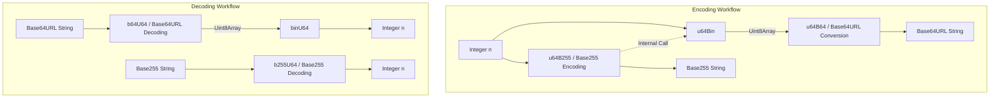

# @3-/intbin : Efficient Conversion Between Integers, Binaries, and URL-Safe Base64/Base255 Encoded Strings

## Table of Contents

- [Features](#features)
- [Demonstration](#demonstration)
- [Design & Call Flow](#design--call-flow)
- [Technology Stack](#technology-stack)
- [Directory Structure](#directory-structure)
- [History & Technical Anecdote](#history--technical-anecdote)

## Features

This library facilitates high-performance conversion between safe integers (up to 53-bit precision), binaries (`Uint8Array`), URL-safe Base64 strings, and Base255 strings.
Core features include:

- Conversion between integers and compact binary byte streams, with automatic trimming of high-order zero bytes to minimize storage footprint.
- Conversion between integers and URL-safe Base64 (unpadded) strings.
- Conversion between integers and Base255 strings.
- Base255 guarantees that the generated string never contains the colon character (`:`), making it suitable for composite keys delimited by colons.
- Pure browser-compatible API implementation (utilizing `Uint8Array`, `atob`, and `btoa`), removing Node.js `Buffer` dependency for seamless execution across browsers, Node.js, and Bun.

## Demonstration

Refer to [test/main.js](file:///Users/z/i18n/lib/intbin/test/main.js) for execution examples:

```javascript
import binU64 from "@3-/intbin/binU64.js";
import u64Bin from "@3-/intbin/u64Bin.js";
import u64B64 from "@3-/intbin/u64B64.js";
import b64U64 from "@3-/intbin/b64U64.js";
import u64B255 from "@3-/intbin/u64B255.js";
import b255U64 from "@3-/intbin/b255U64.js";

// 1. Integer to Binary
const bin = u64Bin(51230); // returns Uint8Array
const num = binU64(bin); // returns 51230

// 2. Integer to Base64URL
const b64 = u64B64(51230); // returns "Hsg"
const numB64 = b64U64(b64); // returns 51230

// 3. Integer to Base255
const b255 = u64B255(51230); // returns Base255 encoded string
const numB255 = b255U64(b255); // returns 51230
```

## Design & Call Flow

Integers are translated to binaries first, and then translated to target text encodings.
The calling relationship and flow is illustrated below:



In the Base255 encoding process, bytes are treated as radix-255 digits. To prevent the occurrence of colon characters (`:`, ASCII 58), any digit value equal to or greater than 58 is incremented by 1 during encoding and decremented by 1 during decoding.

## Technology Stack

- **Runtimes**: Bun, Node.js (v16+), modern web browsers
- **Standard**: ES6+ (JavaScript modules ESM)
- **APIs**: `Uint8Array`, `btoa`, `atob`

## Directory Structure

```
.
├── src/            # Source code directory
│   ├── b255U64.js  # Base255 string to integer conversion
│   ├── b64U64.js   # Base64URL string to integer conversion
│   ├── binU64.js   # Binary to integer conversion
│   ├── u64B255.js  # Integer to Base255 string conversion
│   ├── u64B64.js   # Integer to Base64URL string conversion
│   └── u64Bin.js   # Integer to binary conversion
├── test/           # Test scripts directory
│   └── main.js     # Bun-executable test suite
├── run.sh          # Build and test execution script
└── package.json    # Project metadata configuration
```

## History & Technical Anecdote

The history of Base64 dates back to early email communication systems. Under the SMTP protocol, mail systems could only transmit 7-bit ASCII characters reliably. Non-textual binaries such as images or attachments frequently ended up corrupted when transmitted directly. To ensure transmission integrity, RFCs defined Base64 encoding to map groups of 3 binary bytes into 4 character symbols chosen from a safe character set (A-Z, a-z, 0-9, +, /).

Base255 represents a specialized variation of this encoding strategy. In distributed databases or key-value storage designs, composite keys are often constructed by joining multiple identifiers using a colon (`:`) separator. Standard encodings containing colons break field parsers. By omitting colon characters entirely (ASCII 58), Base255 provides a collision-free, high-density key serialization scheme without requiring character escaping.
