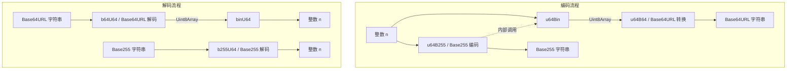

# @3-/intbin : 整数与二进制及 URL 安全 Base64/Base255 编码的高效转换工具

## 目录

- [功能介绍](#功能介绍)
- [演示说明](#演示说明)
- [设计思路与流程](#设计思路与流程)
- [技术堆栈](#技术堆栈)
- [目录结构](#目录结构)
- [技术与历史小故事](#技术与历史小故事)

## 功能介绍

本库主要提供整数（安全整数范围内，最大支持 53 位）与二进制数据（Uint8Array）、URL 安全 Base64 编码以及 Base255 编码之间的互转。
主要包含以下核心功能：

- 整数与紧凑二进制字节流的互转，自动截断高位零字节以节省存储空间。
- 整数与 URL 安全 Base64（无填充）编码字符串的互转。
- 整数与 Base255 编码字符串的互转。
- Base255 编码保证生成的字符串不含冒号（`:`），适合用于以冒号作为分隔符的多字段组合键。
- 采用原生浏览器兼容的 API（如 `Uint8Array`、`atob`、`btoa`），摆脱了对 Node.js `Buffer` 的依赖，在浏览器环境和 Node.js/Bun 环境下均可直接运行。

## 演示说明

详细的使用演示可参考 [test/main.js](file:///Users/z/i18n/lib/intbin/test/main.js)：

```javascript
import binU64 from "@3-/intbin/binU64.js";
import u64Bin from "@3-/intbin/u64Bin.js";
import u64B64 from "@3-/intbin/u64B64.js";
import b64U64 from "@3-/intbin/b64U64.js";
import u64B255 from "@3-/intbin/u64B255.js";
import b255U64 from "@3-/intbin/b255U64.js";

// 1. 整数与二进制转换
const bin = u64Bin(51230); // 返回 Uint8Array
const num = binU64(bin); // 返回 51230

// 2. 整数与 Base64URL 转换
const b64 = u64B64(51230); // 返回 "Hsg"
const numB64 = b64U64(b64); // 返回 51230

// 3. 整数与 Base255 转换
const b255 = u64B255(51230); // 返回 Base255 编码字符串
const numB255 = b255U64(b255); // 返回 51230
```

## 设计思路与流程

本项目通过将整数转换为二进制表示，再对二进制进行特定的文本编码。
整个转换逻辑流程图如下：



在 Base255 编码中，数据被视作 255 进制数进行转换。为了防止输出文本中包含冒号（`:`），对于所有数值大于等于 58（冒号的 ASCII 码）的数位，均自动加 1。解码时则逆向减 1，还原为原始字节。

## 技术堆栈

- **运行环境**: Bun, Node.js (v16+), 现代浏览器
- **语言标准**: ES6+ (JavaScript 模块化 ESM)
- **底层 API**: `Uint8Array`, `btoa`, `atob`

## 目录结构

```
.
├── src/            # 源代码目录
│   ├── b255U64.js  # Base255 字符串转整数
│   ├── b64U64.js   # Base64URL 字符串转整数
│   ├── binU64.js   # 二进制转整数
│   ├── u64B255.js  # 整数转 Base255 字符串
│   ├── u64B64.js   # 整数转 Base64URL 字符串
│   └── u64Bin.js   # 整数转二进制
├── test/           # 测试代码目录
│   └── main.js     # 基于 Bun 的测试脚本
├── run.sh          # 构建与测试执行脚本
└── package.json    # 项目配置信息
```

## 技术与历史小故事

Base64 编码起源于早期网络通信。在 SMTP 协议设计之初，电子邮件系统仅能可靠地传输 7 位 ASCII 字符，二进制文件（如图片或附件）在传输过程中经常因控制字符被截断而损坏。为了解决信息完整性问题，RFC 定义了 Base64 编码，将 3 字节的二进制数据合并转换为 4 个由安全字符集（A-Z, a-z, 0-9, +, /）组成的字符。

Base255 则是这种设计的衍生变体。在现代分布式系统和高性能数据库设计中，通常需要将多个实体 ID 或时间戳拼接为单一复合主键。复合主键常用冒号（`:`）作为字段分隔符。如果在主键各个部分的编码中包含了冒号，解析时就会产生歧义。Base255 编码排除 ASCII 字符集中的冒号（第 58 号字符），提供了字符无冲突、高密度存储、无需转义的组合键生成方案。
