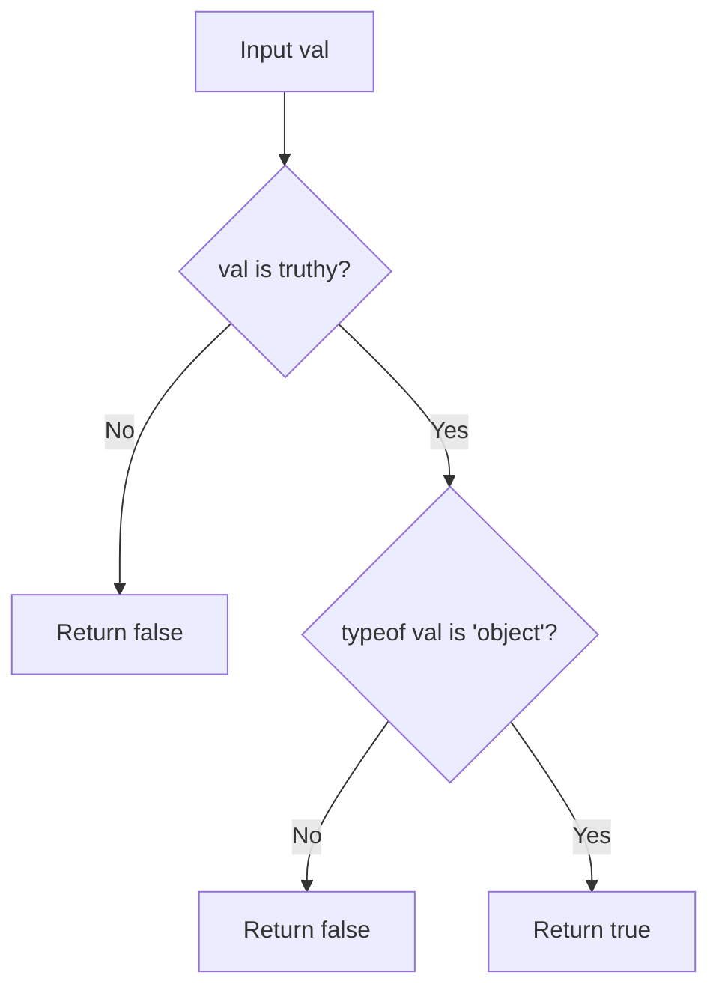
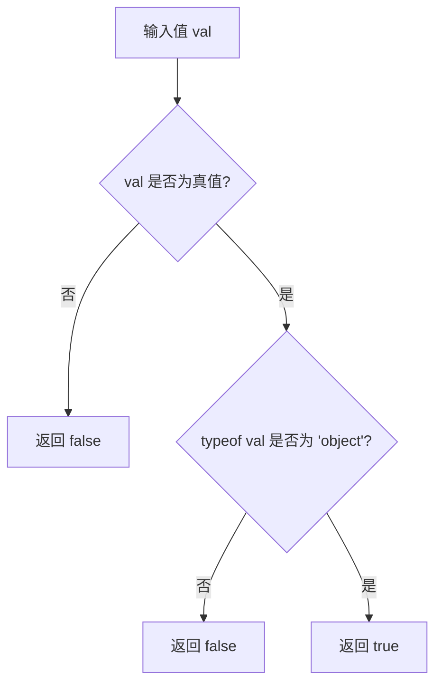

[English](#en) | [中文](#zh)

---

<a id="en"></a>

# @3-/is_obj : Non-null object validator

## Table of Contents

- [Introduction](#introduction)
- [Installation](#installation)
- [Usage Demo](#usage-demo)
- [Design & Architecture](#design--architecture)
- [Directory Structure](#directory-structure)
- [Tech Stack](#tech-stack)
- [History & Trivia](#history--trivia)

## Introduction

`@3-/is_obj` checks if value is non-null object.

## Installation

Install with `bun`:

```bash
bun i @3-/is_obj
```

## Usage Demo

Import function, pass value to check:

```javascript
import isObj from "@3-/is_obj";

isObj({}); // true
isObj([]); // true
isObj(null); // false
isObj(123); // false
```

## Design & Architecture

The function checks value truthiness and evaluates `typeof` operator.

Evaluation flow:



## Directory Structure

```
.
├── src/
│   └── lib.js      # Core logic
└── package.json    # Package configuration
```

## Tech Stack

- **JavaScript (ES Modules)**: Core implementation language.
- **Bun**: Dependency management.

## History & Trivia

In JavaScript, `typeof null` returns `"object"`. This behavior is a remnant from the first version of JavaScript.

Early implementations stored values using type tags. The type tag for objects was `0`. Because `null` was represented as the null pointer (all zeros), the engine interpreted the type tag of `null` as `0`.

`@3-/is_obj` filters out `null` before checking if `typeof` returns `"object"`.

---

<a id="zh"></a>

# @3-/is_obj : 非空对象验证工具

## 目录

- [功能介绍](#功能介绍)
- [安装](#安装)
- [使用演示](#使用演示)
- [设计思路](#设计思路)
- [目录结构](#目录结构)
- [技术堆栈](#技术堆栈)
- [历史小故事](#历史小故事)

## 功能介绍

`@3-/is_obj` 用于判断输入值是否为非空对象。

## 安装

使用 `bun` 安装：

```bash
bun i @3-/is_obj
```

## 使用演示

导入函数，传入待检测值：

```javascript
import isObj from "@3-/is_obj";

isObj({}); // true
isObj([]); // true
isObj(null); // false
isObj(123); // false
```

## 设计思路

函数首先验证输入值真值属性，随后使用 `typeof` 运算符判定。

判定流程：



## 目录结构

```
.
├── src/
│   └── lib.js      # 核心逻辑
└── package.json    # 项目配置
```

## 技术堆栈

- **JavaScript (ES Modules)**: 核心逻辑语言。
- **Bun**: 依赖管理。

## 历史小故事

在 JavaScript 中，`typeof null` 返回 `"object"`。此现象为早期版本遗留问题。

早期 JavaScript 引擎使用类型标签区分不同数据类型。对象类型标签定义为 `0`。由于 `null` 表示空指针（二进制全为 `0`），导致引擎将 `null` 识别为对象。

`@3-/is_obj` 在验证 `typeof` 前排除 `null` 值，以避免上述问题导致判定失准。

---

## About

This project is an open-source component of [i18n.site ⋅ Internationalization Solution](https://i18n.site).

- [i18 : MarkDown Command Line Translation Tool](https://i18n.site/i18)

  The translation perfectly maintains the Markdown format.

  It recognizes file changes and only translates the modified files.

  The translated Markdown content is editable; if you modify the original text and translate it again, manually edited translations will not be overwritten (as long as the original text has not been changed).

- [i18n.site : MarkDown Multi-language Static Site Generator](https://i18n.site/i18n.site)

  Optimized for a better reading experience

## 关于

本项目为 [i18n.site ⋅ 国际化解决方案](https://i18n.site) 的开源组件。

- [i18 : MarkDown命令行翻译工具](https://i18n.site/i18)

  翻译能够完美保持 Markdown 的格式。能识别文件的修改，仅翻译有变动的文件。

  Markdown 翻译内容可编辑；如果你修改原文并再次机器翻译，手动修改过的翻译不会被覆盖（如果这段原文没有被修改）。

- [i18n.site : MarkDown多语言静态站点生成器](https://i18n.site/i18n.site) 为阅读体验而优化。
