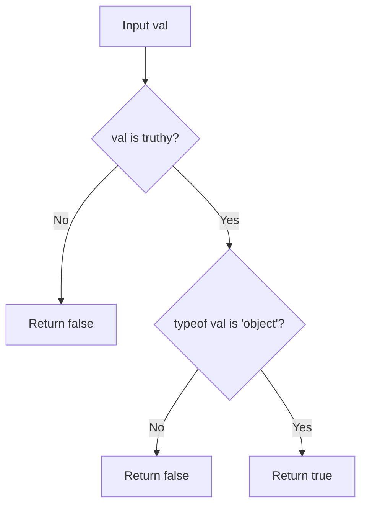

# @3-/is_obj : Non-null object validator

## Table of Contents

- [Introduction](#introduction)
- [Installation](#installation)
- [Usage Demo](#usage-demo)
- [Design & Architecture](#design--architecture)
- [Directory Structure](#directory-structure)
- [Tech Stack](#tech-stack)
- [History & Trivia](#history--trivia)

## Introduction

`@3-/is_obj` checks if value is non-null object.

## Installation

Install with `bun`:

```bash
bun i @3-/is_obj
```

## Usage Demo

Import function, pass value to check:

```javascript
import isObj from "@3-/is_obj";

isObj({}); // true
isObj([]); // true
isObj(null); // false
isObj(123); // false
```

## Design & Architecture

The function checks value truthiness and evaluates `typeof` operator.

Evaluation flow:



## Directory Structure

```
.
├── src/
│   └── lib.js      # Core logic
└── package.json    # Package configuration
```

## Tech Stack

- **JavaScript (ES Modules)**: Core implementation language.
- **Bun**: Dependency management.

## History & Trivia

In JavaScript, `typeof null` returns `"object"`. This behavior is a remnant from the first version of JavaScript.

Early implementations stored values using type tags. The type tag for objects was `0`. Because `null` was represented as the null pointer (all zeros), the engine interpreted the type tag of `null` as `0`.

`@3-/is_obj` filters out `null` before checking if `typeof` returns `"object"`.
