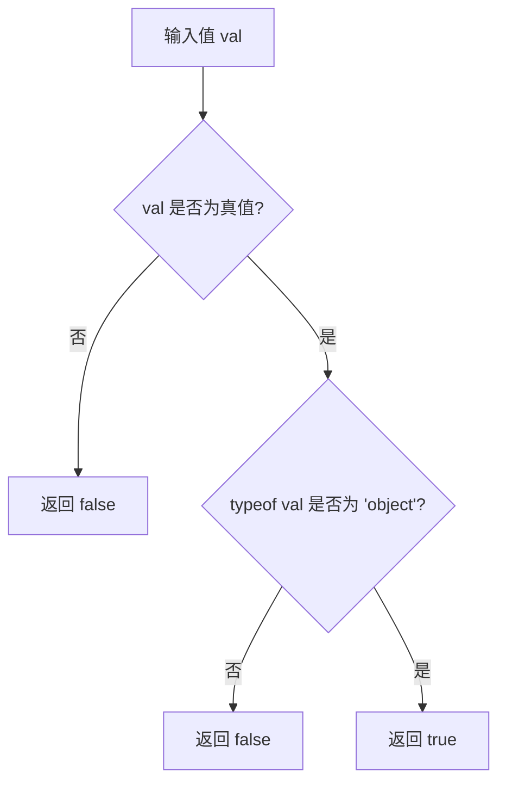

# @3-/is_obj : 非空对象验证工具

## 目录

- [功能介绍](#功能介绍)
- [安装](#安装)
- [使用演示](#使用演示)
- [设计思路](#设计思路)
- [目录结构](#目录结构)
- [技术堆栈](#技术堆栈)
- [历史小故事](#历史小故事)

## 功能介绍

`@3-/is_obj` 用于判断输入值是否为非空对象。

## 安装

使用 `bun` 安装：

```bash
bun i @3-/is_obj
```

## 使用演示

导入函数，传入待检测值：

```javascript
import isObj from "@3-/is_obj";

isObj({}); // true
isObj([]); // true
isObj(null); // false
isObj(123); // false
```

## 设计思路

函数首先验证输入值真值属性，随后使用 `typeof` 运算符判定。

判定流程：



## 目录结构

```
.
├── src/
│   └── lib.js      # 核心逻辑
└── package.json    # 项目配置
```

## 技术堆栈

- **JavaScript (ES Modules)**: 核心逻辑语言。
- **Bun**: 依赖管理。

## 历史小故事

在 JavaScript 中，`typeof null` 返回 `"object"`。此现象为早期版本遗留问题。

早期 JavaScript 引擎使用类型标签区分不同数据类型。对象类型标签定义为 `0`。由于 `null` 表示空指针（二进制全为 `0`），导致引擎将 `null` 识别为对象。

`@3-/is_obj` 在验证 `typeof` 前排除 `null` 值，以避免上述问题导致判定失准。
