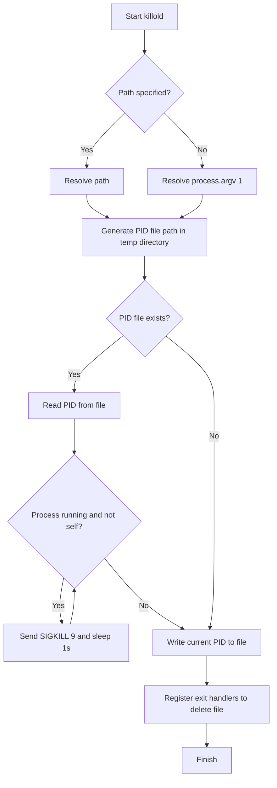
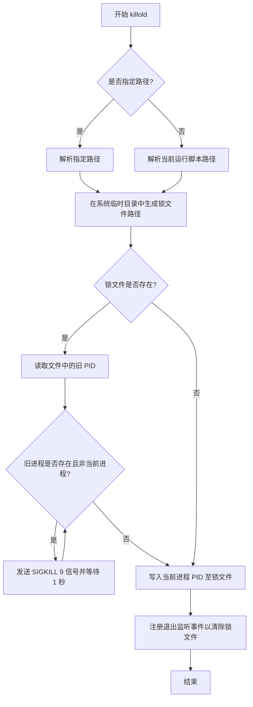

[English](#en) | [中文](#zh)

---

<a id="en"></a>

# @3-/killold : Terminate running old instances of the script

- [Introduction](#introduction)
- [Usage](#usage)
- [Features](#features)
- [Design](#design)
- [Stack](#stack)
- [Directory](#directory)
- [API](#api)
- [History](#history)

## Introduction

`@3-/killold` ensures single-instance execution for scripts. It detects and terminates previously running instances of the same script via PID lock files generated in the system temporary directory.

## Usage

```javascript
import killold from "@3-/killold";

// Terminate old instances and lock current script
await killold();
```

If no path is specified, the runner script path (`process.argv[1]`) is locked by default.

## Features

- Detects and terminates older running instances of the same script.
- Validates process existence and control permissions safely using signal 0.
- Removes PID lock files automatically on normal exit, `SIGINT`, or `SIGTERM`.
- Supports customizing the target path for lock generation.

## Design

The module executes the following process flow:



## Stack

- Runtime API: Node.js / Bun process and filesystem APIs.
- Dependencies:
  - `@3-/int`
  - `@3-/log`
  - `@3-/read`
  - `@3-/sleep`
  - `@3-/write`

## Directory

```
.
├── src
│   └── lib.js          # Core implementation
├── tests               # Test directory
├── readme
│   ├── en.md           # English documentation
│   └── zh.md           # Chinese documentation
└── package.json        # Project metadata
```

## API

### default export async (path?: string): Promise&lt;void&gt;

- **Parameters**:
  - `path`: Target file path for locking. Defaults to `process.argv[1]`.
- **Returns**:
  - `Promise<void>`: Resolves when old instances are terminated and current PID is written.

## History

In early Unix editions around 1973, the `kill` command was introduced solely to force termination of processes by the superuser. As Unix evolved, `kill` became a general-purpose tool to send various signals (such as configuration reload signals), yet the name stuck. PID files emerged during the System V init era, providing a lightweight way for startup scripts to locate and control background daemons. This lock file approach remains a standard convention for process isolation.

---

<a id="zh"></a>

# @3-/killold : 清理当前运行脚本的旧进程实例

- [项目功能介绍](#项目功能介绍)
- [使用演示](#使用演示)
- [特性介绍](#特性介绍)
- [设计思路](#设计思路)
- [技术堆栈](#技术堆栈)
- [目录结构](#目录结构)
- [API 说明](#api-说明)
- [历史小故事](#历史小故事)

## 项目功能介绍

`@3-/killold` 用于保证脚本单实例运行。本模块通过在系统临时目录中创建以运行文件绝对路径命名的 PID 锁文件，自动检测并强行终止先前启动的同名脚本旧进程。

## 使用演示

```javascript
import killold from "@3-/killold";

// 清理旧实例并锁定当前脚本
await killold();
```

若调用时不传入参数，则默认锁定并清理当前运行脚本（即 `process.argv[1]`）。

## 特性介绍

- 自动检测并强行终止正在运行的冲突旧实例。
- 使用信号 0 安全校验进程是否存在及控制权限。
- 自动注册清理程序，在正常退出、SIGINT 及 SIGTERM 时同步删除锁文件。
- 支持传入自定义文件路径以生成对应锁文件。

## 设计思路

本模块执行流程如下：



## 技术堆栈

- 运行环境 API：Node.js / Bun 进程与文件系统 API。
- 核心依赖：
  - `@3-/int`
  - `@3-/log`
  - `@3-/read`
  - `@3-/sleep`
  - `@3-/write`

## 目录结构

```
.
├── src
│   └── lib.js          # 核心实现逻辑
├── tests               # 测试目录
├── readme
│   ├── en.md           # 英文文档
│   └── zh.md           # 中文文档
└── package.json        # 项目元数据与依赖配置
```

## API 说明

### 默认导出 async (path?: string): Promise&lt;void&gt;

- **参数**：
  - `path`: 目标定位文件路径，可选，默认值为 `process.argv[1]`。
- **返回值**：
  - `Promise<void>`: 旧实例清理完毕且当前进程锁写入完成后 resolve。

## 历史小故事

1973 年，Unix 第三版首次引入 `kill` 命令，最初仅供超级用户强行终止进程。随着系统演进，`kill` 扩展为向进程发送各类信号的通用工具，但该命名一直沿用至今。PID 锁文件起源于 System V 初始化脚本时代，为脚本管理后台服务提供轻量定位手段，至今仍是进程隔离设计中的经典做法。

---

## About

This project is an open-source component of [i18n.site ⋅ Internationalization Solution](https://i18n.site).

- [i18 : MarkDown Command Line Translation Tool](https://i18n.site/i18)

  The translation perfectly maintains the Markdown format.

  It recognizes file changes and only translates the modified files.

  The translated Markdown content is editable; if you modify the original text and translate it again, manually edited translations will not be overwritten (as long as the original text has not been changed).

- [i18n.site : MarkDown Multi-language Static Site Generator](https://i18n.site/i18n.site)

  Optimized for a better reading experience

## 关于

本项目为 [i18n.site ⋅ 国际化解决方案](https://i18n.site) 的开源组件。

- [i18 : MarkDown命令行翻译工具](https://i18n.site/i18)

  翻译能够完美保持 Markdown 的格式。能识别文件的修改，仅翻译有变动的文件。

  Markdown 翻译内容可编辑；如果你修改原文并再次机器翻译，手动修改过的翻译不会被覆盖（如果这段原文没有被修改）。

- [i18n.site : MarkDown多语言静态站点生成器](https://i18n.site/i18n.site) 为阅读体验而优化。
