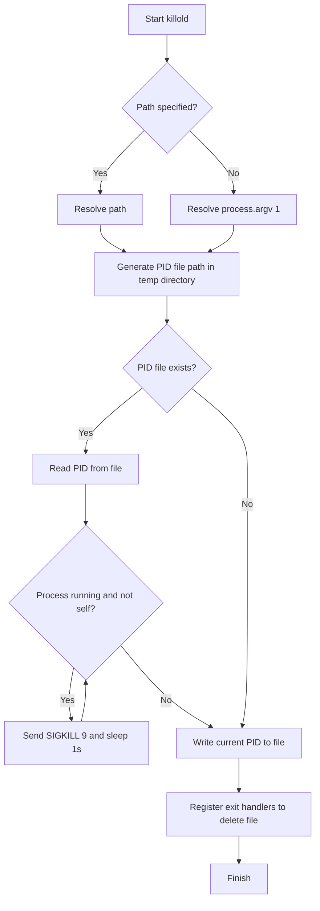

# @3-/killold : Terminate running old instances of the script

- [Introduction](#introduction)
- [Usage](#usage)
- [Features](#features)
- [Design](#design)
- [Stack](#stack)
- [Directory](#directory)
- [API](#api)
- [History](#history)

## Introduction

`@3-/killold` ensures single-instance execution for scripts. It detects and terminates previously running instances of the same script via PID lock files generated in the system temporary directory.

## Usage

```javascript
import killold from "@3-/killold";

// Terminate old instances and lock current script
await killold();
```

If no path is specified, the runner script path (`process.argv[1]`) is locked by default.

## Features

- Detects and terminates older running instances of the same script.
- Validates process existence and control permissions safely using signal 0.
- Removes PID lock files automatically on normal exit, `SIGINT`, or `SIGTERM`.
- Supports customizing the target path for lock generation.

## Design

The module executes the following process flow:



## Stack

- Runtime API: Node.js / Bun process and filesystem APIs.
- Dependencies:
  - `@3-/int`
  - `@3-/log`
  - `@3-/read`
  - `@3-/sleep`
  - `@3-/write`

## Directory

```
.
├── src
│   └── lib.js          # Core implementation
├── tests               # Test directory
├── readme
│   ├── en.md           # English documentation
│   └── zh.md           # Chinese documentation
└── package.json        # Project metadata
```

## API

### default export async (path?: string): Promise&lt;void&gt;

- **Parameters**:
  - `path`: Target file path for locking. Defaults to `process.argv[1]`.
- **Returns**:
  - `Promise<void>`: Resolves when old instances are terminated and current PID is written.

## History

In early Unix editions around 1973, the `kill` command was introduced solely to force termination of processes by the superuser. As Unix evolved, `kill` became a general-purpose tool to send various signals (such as configuration reload signals), yet the name stuck. PID files emerged during the System V init era, providing a lightweight way for startup scripts to locate and control background daemons. This lock file approach remains a standard convention for process isolation.
