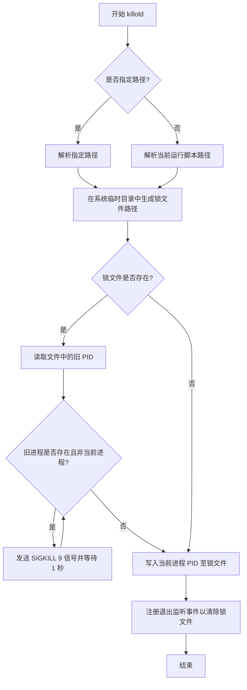

# @3-/killold : 清理当前运行脚本的旧进程实例

- [项目功能介绍](#项目功能介绍)
- [使用演示](#使用演示)
- [特性介绍](#特性介绍)
- [设计思路](#设计思路)
- [技术堆栈](#技术堆栈)
- [目录结构](#目录结构)
- [API 说明](#api-说明)
- [历史小故事](#历史小故事)

## 项目功能介绍

`@3-/killold` 用于保证脚本单实例运行。本模块通过在系统临时目录中创建以运行文件绝对路径命名的 PID 锁文件，自动检测并强行终止先前启动的同名脚本旧进程。

## 使用演示

```javascript
import killold from '@3-/killold';

// 清理旧实例并锁定当前脚本
await killold();
```

若调用时不传入参数，则默认锁定并清理当前运行脚本（即 `process.argv[1]`）。

## 特性介绍

- 自动检测并强行终止正在运行的冲突旧实例。
- 使用信号 0 安全校验进程是否存在及控制权限。
- 自动注册清理程序，在正常退出、SIGINT 及 SIGTERM 时同步删除锁文件。
- 支持传入自定义文件路径以生成对应锁文件。

## 设计思路

本模块执行流程如下：



## 技术堆栈

- 运行环境 API：Node.js / Bun 进程与文件系统 API。
- 核心依赖：
  - `@3-/int`
  - `@3-/log`
  - `@3-/read`
  - `@3-/sleep`
  - `@3-/write`

## 目录结构

```
.
├── src
│   └── lib.js          # 核心实现逻辑
├── tests               # 测试目录
├── readme
│   ├── en.md           # 英文文档
│   └── zh.md           # 中文文档
└── package.json        # 项目元数据与依赖配置
```

## API 说明

### 默认导出 async (path?: string): Promise&lt;void&gt;

- **参数**：
  - `path`: 目标定位文件路径，可选，默认值为 `process.argv[1]`。
- **返回值**：
  - `Promise<void>`: 旧实例清理完毕且当前进程锁写入完成后 resolve。

## 历史小故事

1973 年，Unix 第三版首次引入 `kill` 命令，最初仅供超级用户强行终止进程。随着系统演进，`kill` 扩展为向进程发送各类信号的通用工具，但该命名一直沿用至今。PID 锁文件起源于 System V 初始化脚本时代，为脚本管理后台服务提供轻量定位手段，至今仍是进程隔离设计中的经典做法。