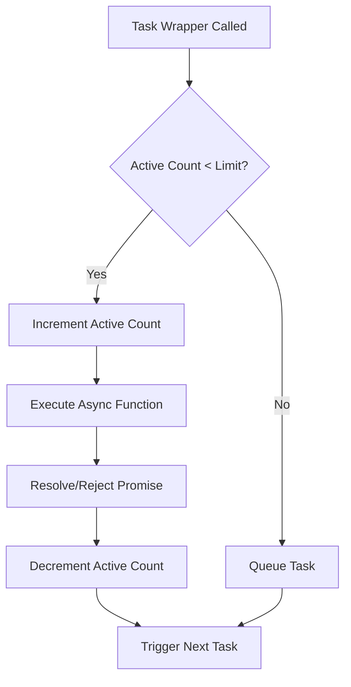
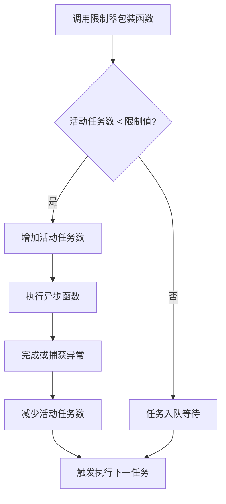

[English](#en) | [中文](#zh)

---

<a id="en"></a>

# @3-/plimit : Concurrency Limit for Async Functions

## Table of Contents

- [Introduction](#introduction)
- [Installation](#installation)
- [Usage Demo](#usage-demo)
- [Design & Architecture](#design--architecture)
- [Directory Structure](#directory-structure)
- [Tech Stack](#tech-stack)
- [History & Trivia](#history--trivia)

## Introduction

`@3-/plimit` restricts the concurrency of asynchronous operations. It runs tasks under a specified concurrency threshold, queuing subsequent tasks until active slots become available.

## Installation

Install using `bun`:

```bash
bun i @3-/plimit
```

## Usage Demo

Import the package, initialize a limiter with the maximum concurrency, and wrap asynchronous functions.

```javascript
import pLimit from "@3-/plimit";

// Initialize concurrency limit of 2
const limit = pLimit(2);

const tasks = [
  limit(() => fetch("https://api.example.com/data/1")),
  limit(() => fetch("https://api.example.com/data/2")),
  limit(() => fetch("https://api.example.com/data/3")),
];

// Resolves when all tasks complete under concurrency limit
const results = await Promise.all(tasks);
```

## Design & Architecture

The limiter maintains an internal task queue. When a task is added:

1. It is pushed into the queue with its promise resolution callbacks.
2. The controller checks if the number of active tasks is below the limit.
3. If below the limit, the next task is dequeued, and its execution begins.
4. When a task resolves or rejects, the active count decrements, and the queue processes the next task.

Below is the execution flow of the concurrency limiter:



## Directory Structure

```
.
├── src/
│   └── lib.js      # Core concurrency limiting logic
└── test/
    └── main.test.js # Unit tests and usage examples
```

## Tech Stack

- **JavaScript (ES Modules)**: Core implementation language.
- **Bun**: Test runner and dependency management.

## History & Trivia

The concept of limiting concurrency traces back to the early days of concurrent computing. In the early 1960s, Dutch computer scientist Edsger W. Dijkstra introduced the concept of the "semaphore" to solve synchronization issues in the THE multiprogramming system.

A semaphore acts as a variable that controls access to a common resource by multiple processes. The concurrency limit implementation in `@3-/plimit` is structurally equivalent to Dijkstra's counting semaphore, where the capacity represents the limit, and the queue coordinates task scheduling.

---

<a id="zh"></a>

# @3-/plimit : 异步函数并发控制

## 目录

- [功能介绍](#功能介绍)
- [安装](#安装)
- [使用演示](#使用演示)
- [设计思路](#设计思路)
- [目录结构](#目录结构)
- [技术堆栈](#技术堆栈)
- [历史小故事](#历史小故事)

## 功能介绍

`@3-/plimit` 限制异步操作并发量。此模块确保在设定的并发阈值下执行任务，并将超出限制的任务排队，直到腾出可用槽位。

## 安装

使用 `bun` 安装：

```bash
bun i @3-/plimit
```

## 使用演示

导入模块，设置最大并发数初始化限制器，包裹异步函数执行。

```javascript
import pLimit from "@3-/plimit";

// 初始化并发限制为 2
const limit = pLimit(2);

const tasks = [
  limit(() => fetch("https://api.example.com/data/1")),
  limit(() => fetch("https://api.example.com/data/2")),
  limit(() => fetch("https://api.example.com/data/3")),
];

// 并发限制下执行，所有任务完成时返回结果
const results = await Promise.all(tasks);
```

## 设计思路

限制器内部维护任务队列。任务加入时：

1. 任务及对应的 Promise 回调存入队列。
2. 控制器检测当前活动任务数是否小于设定的并发限制。
3. 若小于限制，从队列头部取出任务并开始执行。
4. 任务执行完毕（无论成功或失败），递减活动任务数，并触发下一次调度。

下面是并发限制器的调用流程图：



## 目录结构

```
.
├── src/
│   └── lib.js      # 核心并发限制逻辑
└── test/
    └── main.test.js # 单元测试与演示代码
```

## 技术堆栈

- **JavaScript (ES Modules)**: 核心逻辑语言。
- **Bun**: 测试运行器及依赖管理。

## 历史小故事

并发限制的概念源于早期并发计算。20世纪60年代初，荷兰计算机科学家艾兹赫尔·戴克斯特拉（Edsger W. Dijkstra）在设计 THE 多道程序设计系统时，提出了“信号量（Semaphore）”概念，用于解决多进程同步问题。

信号量用于控制多个进程对共享资源的访问。`@3-/plimit` 实现的并发限制器，在结构上相当于戴克斯特拉提出的计数信号量（Counting Semaphore）。限制值即信号量初始容量，队列负责协调任务调度。

---

## About

This project is an open-source component of [i18n.site ⋅ Internationalization Solution](https://i18n.site).

- [i18 : MarkDown Command Line Translation Tool](https://i18n.site/i18)

  The translation perfectly maintains the Markdown format.

  It recognizes file changes and only translates the modified files.

  The translated Markdown content is editable; if you modify the original text and translate it again, manually edited translations will not be overwritten (as long as the original text has not been changed).

- [i18n.site : MarkDown Multi-language Static Site Generator](https://i18n.site/i18n.site)

  Optimized for a better reading experience

## 关于

本项目为 [i18n.site ⋅ 国际化解决方案](https://i18n.site) 的开源组件。

- [i18 : MarkDown命令行翻译工具](https://i18n.site/i18)

  翻译能够完美保持 Markdown 的格式。能识别文件的修改，仅翻译有变动的文件。

  Markdown 翻译内容可编辑；如果你修改原文并再次机器翻译，手动修改过的翻译不会被覆盖（如果这段原文没有被修改）。

- [i18n.site : MarkDown多语言静态站点生成器](https://i18n.site/i18n.site) 为阅读体验而优化。
