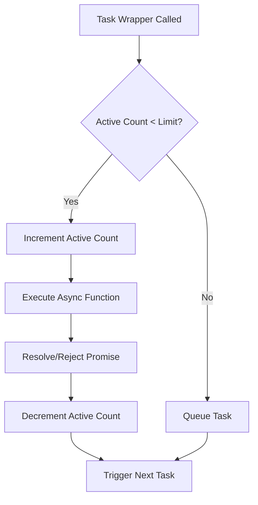

# @3-/plimit : Concurrency Limit for Async Functions

## Table of Contents

- [Introduction](#introduction)
- [Installation](#installation)
- [Usage Demo](#usage-demo)
- [Design & Architecture](#design--architecture)
- [Directory Structure](#directory-structure)
- [Tech Stack](#tech-stack)
- [History & Trivia](#history--trivia)

## Introduction

`@3-/plimit` restricts the concurrency of asynchronous operations. It runs tasks under a specified concurrency threshold, queuing subsequent tasks until active slots become available.

## Installation

Install using `bun`:

```bash
bun i @3-/plimit
```

## Usage Demo

Import the package, initialize a limiter with the maximum concurrency, and wrap asynchronous functions.

```javascript
import pLimit from "@3-/plimit";

// Initialize concurrency limit of 2
const limit = pLimit(2);

const tasks = [
  limit(() => fetch("https://api.example.com/data/1")),
  limit(() => fetch("https://api.example.com/data/2")),
  limit(() => fetch("https://api.example.com/data/3")),
];

// Resolves when all tasks complete under concurrency limit
const results = await Promise.all(tasks);
```

## Design & Architecture

The limiter maintains an internal task queue. When a task is added:

1. It is pushed into the queue with its promise resolution callbacks.
2. The controller checks if the number of active tasks is below the limit.
3. If below the limit, the next task is dequeued, and its execution begins.
4. When a task resolves or rejects, the active count decrements, and the queue processes the next task.

Below is the execution flow of the concurrency limiter:



## Directory Structure

```
.
├── src/
│   └── lib.js      # Core concurrency limiting logic
└── test/
    └── main.test.js # Unit tests and usage examples
```

## Tech Stack

- **JavaScript (ES Modules)**: Core implementation language.
- **Bun**: Test runner and dependency management.

## History & Trivia

The concept of limiting concurrency traces back to the early days of concurrent computing. In the early 1960s, Dutch computer scientist Edsger W. Dijkstra introduced the concept of the "semaphore" to solve synchronization issues in the THE multiprogramming system.

A semaphore acts as a variable that controls access to a common resource by multiple processes. The concurrency limit implementation in `@3-/plimit` is structurally equivalent to Dijkstra's counting semaphore, where the capacity represents the limit, and the queue coordinates task scheduling.
