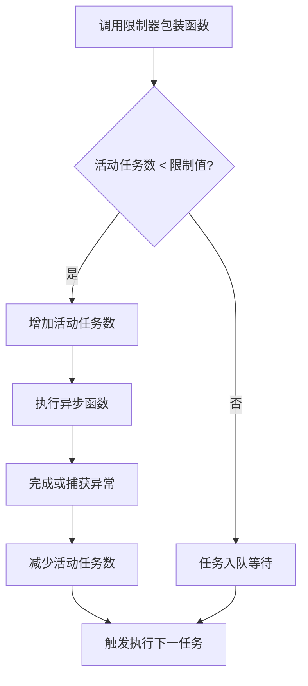

# @3-/plimit : 异步函数并发控制

## 目录

- [功能介绍](#功能介绍)
- [安装](#安装)
- [使用演示](#使用演示)
- [设计思路](#设计思路)
- [目录结构](#目录结构)
- [技术堆栈](#技术堆栈)
- [历史小故事](#历史小故事)

## 功能介绍

`@3-/plimit` 限制异步操作并发量。此模块确保在设定的并发阈值下执行任务，并将超出限制的任务排队，直到腾出可用槽位。

## 安装

使用 `bun` 安装：

```bash
bun i @3-/plimit
```

## 使用演示

导入模块，设置最大并发数初始化限制器，包裹异步函数执行。

```javascript
import pLimit from "@3-/plimit";

// 初始化并发限制为 2
const limit = pLimit(2);

const tasks = [
  limit(() => fetch("https://api.example.com/data/1")),
  limit(() => fetch("https://api.example.com/data/2")),
  limit(() => fetch("https://api.example.com/data/3")),
];

// 并发限制下执行，所有任务完成时返回结果
const results = await Promise.all(tasks);
```

## 设计思路

限制器内部维护任务队列。任务加入时：

1. 任务及对应的 Promise 回调存入队列。
2. 控制器检测当前活动任务数是否小于设定的并发限制。
3. 若小于限制，从队列头部取出任务并开始执行。
4. 任务执行完毕（无论成功或失败），递减活动任务数，并触发下一次调度。

下面是并发限制器的调用流程图：



## 目录结构

```
.
├── src/
│   └── lib.js      # 核心并发限制逻辑
└── test/
    └── main.test.js # 单元测试与演示代码
```

## 技术堆栈

- **JavaScript (ES Modules)**: 核心逻辑语言。
- **Bun**: 测试运行器及依赖管理。

## 历史小故事

并发限制的概念源于早期并发计算。20世纪60年代初，荷兰计算机科学家艾兹赫尔·戴克斯特拉（Edsger W. Dijkstra）在设计 THE 多道程序设计系统时，提出了“信号量（Semaphore）”概念，用于解决多进程同步问题。

信号量用于控制多个进程对共享资源的访问。`@3-/plimit` 实现的并发限制器，在结构上相当于戴克斯特拉提出的计数信号量（Counting Semaphore）。限制值即信号量初始容量，队列负责协调任务调度。
