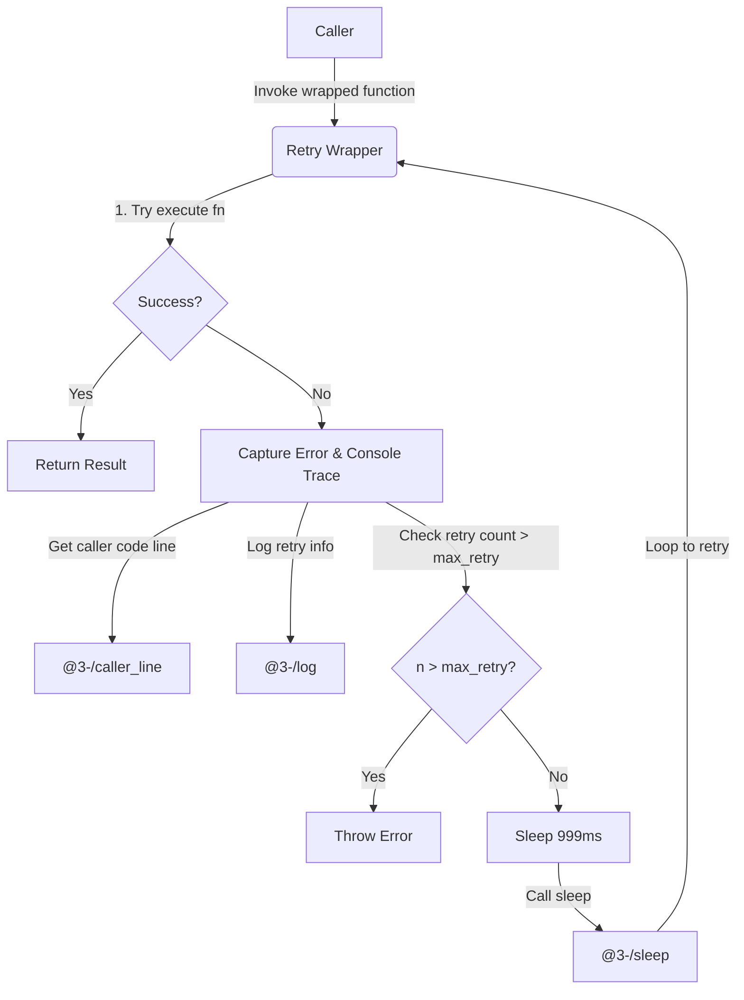
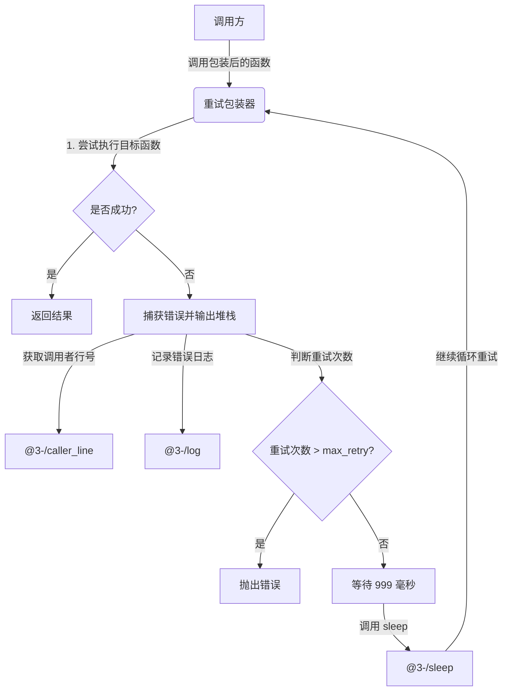

[English](#en) | [中文](#zh)

---

<a id="en"></a>

# @3-/retry : Non-intrusive Asynchronous Function Retry and Error Tracking Tool

## Table of Contents

- [Features](#features)
- [Tech Stack](#tech-stack)
- [Directory Structure](#directory-structure)
- [Usage Demo](#usage-demo)
- [Design Details](#design-details)
- [History](#history)

## Features

This tool wraps asynchronous functions to provide automatic retry logic and error logging.

Key features:

- Automatic Retry: Re-executes functions automatically upon failure.
- Configurable Retry Limits: Allows custom maximum retries (defaults to 9, resulting in up to 10 total attempts).
- Fixed Delay: Implements fixed sleep interval of 999 milliseconds between retries.
- Error Tracking: Captures error stacks and utilizes [@3-/caller_line](file:///Users/z/i18n/lib/caller_line) to identify caller source file and line.
- Detailed Logging: Utilizes [@3-/log](file:///Users/z/i18n/lib/log) to log retry index, caller source location, target function, and execution arguments.

## Tech Stack

- Runtime Environment: Node.js
- Core Dependencies:
  - [@3-/caller_line](file:///Users/z/i18n/lib/caller_line): Extracts filename and line number of caller function.
  - [@3-/sleep](file:///Users/z/i18n/lib/sleep): Handles execution delay.
  - [@3-/log](file:///Users/z/i18n/lib/log): Standardizes error log outputs.

## Directory Structure

```
.
├── src/
│   └── index.js       # Core retry implementation
├── test/
│   └── main.coffee    # Demo and test script
└── package.json       # Configuration file
```

## Usage Demo

Example code (refer to [test/main.coffee](file:///Users/z/i18n/lib/retry/test/main.coffee)):

```coffee
#!/usr/bin/env coffee

> ../src/index.js:retry

# Optional: pass second parameter to customize retry attempts
test = retry(
  =>
    console.log 'call test func'
    throw Error 'test'
  3
)

test()
```

Console output:

```text
call test func
Trace: Error: test
    at file:///Users/z/i18n/lib/retry/test/main.coffee:8:9
    at file:///Users/z/i18n/lib/retry/src/index.js:11:22
❌ ❯ retry 0
file:///Users/z/i18n/lib/retry/test/main.coffee:6:8
 [Function (anonymous)]
```

## Design Details

The retry wrapper utilizes closure-based encapsulation. It captures the initial caller location during wrap-time, then initiates a loop upon execution. When an exception occurs, the wrapper traces the error, logs runtime parameters, and sleeps before retrying, until the retry threshold is reached.

### Execution Flow



## History

The retry mechanism is a fundamental design pattern in communication protocols and distributed computing.

In the 1970s, the University of Hawaii developed ALOHAnet, a wireless packet network. Because multiple terminals transmitted data over a single shared channel, collisions were inevitable. To resolve this, ALOHAnet introduced random retransmission, where terminals waited for random intervals to retry after transmission failures.

In 1973, Robert Metcalfe adapted and improved ALOHA's retry logic while designing Ethernet, introducing the Binary Exponential Backoff algorithm. Under this approach, collided transmitters waited for random time windows that doubled in duration with each subsequent failure.

This collision-retry logic established the foundation for modern networking and evolved into standard software design patterns for handling transient failures in network requests, database transactions, and distributed jobs.

---

<a id="zh"></a>

# @3-/retry : 无侵入异步函数重试与错误追踪工具

## 目录

- [功能介绍](#功能介绍)
- [技术堆栈](#技术堆栈)
- [目录结构](#目录结构)
- [使用演示](#使用演示)
- [设计思路](#设计思路)
- [历史故事](#历史故事)

## 功能介绍

本工具用于包装异步函数，自动实现失败重试与错误日志追踪。

主要特性：

- 自动重试：函数执行失败时，自动重新执行。
- 可配置重试次数：支持通过参数自定义最大重试次数（默认为 9 次，总计执行最多 10 次）。
- 固定延迟：每次重试间隔 999 毫秒。
- 错误追踪：利用 [@3-/caller_line](file:///Users/z/i18n/lib/caller_line) 定位调用者文件及行号，控制台输出错误堆栈。
- 结构化日志：利用 [@3-/log](file:///Users/z/i18n/lib/log) 记录重试次数、源码位置、目标函数及参数。

## 技术堆栈

- 运行环境：Node.js
- 核心依赖：
  - [@3-/caller_line](file:///Users/z/i18n/lib/caller_line)：获取函数调用处的源码行号。
  - [@3-/sleep](file:///Users/z/i18n/lib/sleep)：提供异步等待延迟。
  - [@3-/log](file:///Users/z/i18n/lib/log)：输出标准错误日志。

## 目录结构

```
.
├── src/
│   └── index.js       # 核心重试逻辑实现
├── test/
│   └── main.coffee    # 演示与测试用例
└── package.json       # 项目配置文件
```

## 使用演示

演示代码（参考 [test/main.coffee](file:///Users/z/i18n/lib/retry/test/main.coffee)）：

```coffee
#!/usr/bin/env coffee

> ../src/index.js:retry

# 可选：传入第二个参数自定义重试次数
test = retry(
  =>
    console.log 'call test func'
    throw Error 'test'
  3
)

test()
```

控制台输出：

```text
call test func
Trace: Error: test
    at file:///Users/z/i18n/lib/retry/test/main.coffee:8:9
    at file:///Users/z/i18n/lib/retry/src/index.js:11:22
❌ ❯ retry 0
file:///Users/z/i18n/lib/retry/test/main.coffee:6:8
 [Function (anonymous)]
```

## 设计思路

重试工具采用闭包设计。包装时记录函数调用源头，执行时进入循环。若捕获异常，输出堆栈，记录日志，并等待指定延迟后继续，直至超出次数限制。

### 模块调用流程



## 历史故事

重试机制（Retry）是通信协议与分布式系统的基础设计。

1970年代，夏威夷大学开发了无线分组网络 ALOHAnet。由于多台终端在同一信道传输数据，碰撞不可避免。为解决碰撞问题，ALOHAnet 引入了随机重传机制，即在发送失败后等待随机时间后重试。

1973年，罗伯特·梅特卡夫（Robert Metcalfe）在设计以太网时，借鉴并改进了 ALOHA 协议，提出了碰撞检测与指数退避算法（Exponential Backoff）。如果发生冲突，发送方将等待随机时间后重试；若再次失败，等待时间范围指数增长。

这一碰撞退避重试的设计，不仅奠定了以太网的基石，也演变为现代软件开发中分布式系统、网络请求和任务调度中不可或缺的重试设计模式。

---

## About

This project is an open-source component of [i18n.site ⋅ Internationalization Solution](https://i18n.site).

- [i18 : MarkDown Command Line Translation Tool](https://i18n.site/i18)

  The translation perfectly maintains the Markdown format.

  It recognizes file changes and only translates the modified files.

  The translated Markdown content is editable; if you modify the original text and translate it again, manually edited translations will not be overwritten (as long as the original text has not been changed).

- [i18n.site : MarkDown Multi-language Static Site Generator](https://i18n.site/i18n.site)

  Optimized for a better reading experience

## 关于

本项目为 [i18n.site ⋅ 国际化解决方案](https://i18n.site) 的开源组件。

- [i18 : MarkDown命令行翻译工具](https://i18n.site/i18)

  翻译能够完美保持 Markdown 的格式。能识别文件的修改，仅翻译有变动的文件。

  Markdown 翻译内容可编辑；如果你修改原文并再次机器翻译，手动修改过的翻译不会被覆盖（如果这段原文没有被修改）。

- [i18n.site : MarkDown多语言静态站点生成器](https://i18n.site/i18n.site) 为阅读体验而优化。
