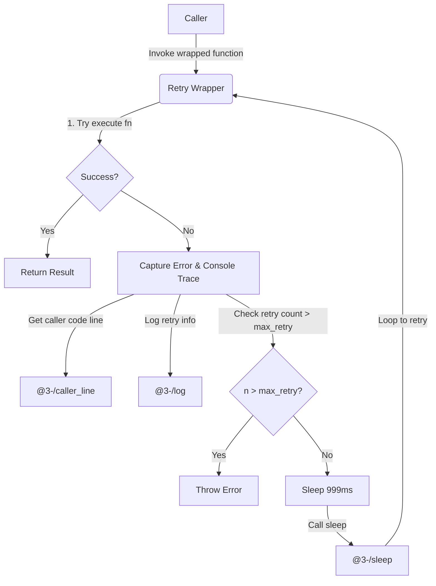

# @3-/retry : Non-intrusive Asynchronous Function Retry and Error Tracking Tool

## Table of Contents

- [Features](#features)
- [Tech Stack](#tech-stack)
- [Directory Structure](#directory-structure)
- [Usage Demo](#usage-demo)
- [Design Details](#design-details)
- [History](#history)

## Features

This tool wraps asynchronous functions to provide automatic retry logic and error logging.

Key features:

- Automatic Retry: Re-executes functions automatically upon failure.
- Configurable Retry Limits: Allows custom maximum retries (defaults to 9, resulting in up to 10 total attempts).
- Fixed Delay: Implements fixed sleep interval of 999 milliseconds between retries.
- Error Tracking: Captures error stacks and utilizes [@3-/caller_line](file:///Users/z/i18n/lib/caller_line) to identify caller source file and line.
- Detailed Logging: Utilizes [@3-/log](file:///Users/z/i18n/lib/log) to log retry index, caller source location, target function, and execution arguments.

## Tech Stack

- Runtime Environment: Node.js
- Core Dependencies:
  - [@3-/caller_line](file:///Users/z/i18n/lib/caller_line): Extracts filename and line number of caller function.
  - [@3-/sleep](file:///Users/z/i18n/lib/sleep): Handles execution delay.
  - [@3-/log](file:///Users/z/i18n/lib/log): Standardizes error log outputs.

## Directory Structure

```
.
├── src/
│   └── index.js       # Core retry implementation
├── test/
│   └── main.coffee    # Demo and test script
└── package.json       # Configuration file
```

## Usage Demo

Example code (refer to [test/main.coffee](file:///Users/z/i18n/lib/retry/test/main.coffee)):

```coffee
#!/usr/bin/env coffee

> ../src/index.js:retry

# Optional: pass second parameter to customize retry attempts
test = retry(
  =>
    console.log 'call test func'
    throw Error 'test'
  3
)

test()
```

Console output:

```text
call test func
Trace: Error: test
    at file:///Users/z/i18n/lib/retry/test/main.coffee:8:9
    at file:///Users/z/i18n/lib/retry/src/index.js:11:22
❌ ❯ retry 0
file:///Users/z/i18n/lib/retry/test/main.coffee:6:8
 [Function (anonymous)]
```

## Design Details

The retry wrapper utilizes closure-based encapsulation. It captures the initial caller location during wrap-time, then initiates a loop upon execution. When an exception occurs, the wrapper traces the error, logs runtime parameters, and sleeps before retrying, until the retry threshold is reached.

### Execution Flow



## History

The retry mechanism is a fundamental design pattern in communication protocols and distributed computing.

In the 1970s, the University of Hawaii developed ALOHAnet, a wireless packet network. Because multiple terminals transmitted data over a single shared channel, collisions were inevitable. To resolve this, ALOHAnet introduced random retransmission, where terminals waited for random intervals to retry after transmission failures.

In 1973, Robert Metcalfe adapted and improved ALOHA's retry logic while designing Ethernet, introducing the Binary Exponential Backoff algorithm. Under this approach, collided transmitters waited for random time windows that doubled in duration with each subsequent failure.

This collision-retry logic established the foundation for modern networking and evolved into standard software design patterns for handling transient failures in network requests, database transactions, and distributed jobs.
