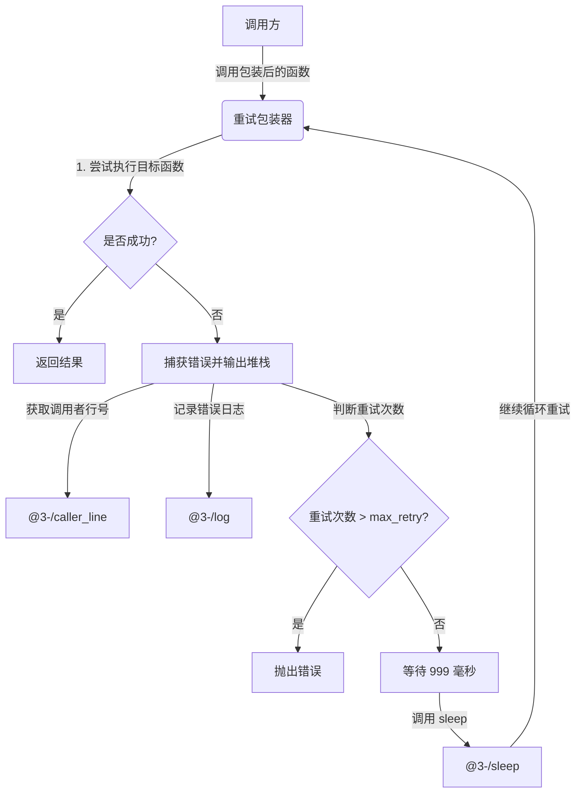

# @3-/retry : 无侵入异步函数重试与错误追踪工具

## 目录

- [功能介绍](#功能介绍)
- [技术堆栈](#技术堆栈)
- [目录结构](#目录结构)
- [使用演示](#使用演示)
- [设计思路](#设计思路)
- [历史故事](#历史故事)

## 功能介绍

本工具用于包装异步函数，自动实现失败重试与错误日志追踪。

主要特性：

- 自动重试：函数执行失败时，自动重新执行。
- 可配置重试次数：支持通过参数自定义最大重试次数（默认为 9 次，总计执行最多 10 次）。
- 固定延迟：每次重试间隔 999 毫秒。
- 错误追踪：利用 [@3-/caller_line](file:///Users/z/i18n/lib/caller_line) 定位调用者文件及行号，控制台输出错误堆栈。
- 结构化日志：利用 [@3-/log](file:///Users/z/i18n/lib/log) 记录重试次数、源码位置、目标函数及参数。

## 技术堆栈

- 运行环境：Node.js
- 核心依赖：
  - [@3-/caller_line](file:///Users/z/i18n/lib/caller_line)：获取函数调用处的源码行号。
  - [@3-/sleep](file:///Users/z/i18n/lib/sleep)：提供异步等待延迟。
  - [@3-/log](file:///Users/z/i18n/lib/log)：输出标准错误日志。

## 目录结构

```
.
├── src/
│   └── index.js       # 核心重试逻辑实现
├── test/
│   └── main.coffee    # 演示与测试用例
└── package.json       # 项目配置文件
```

## 使用演示

演示代码（参考 [test/main.coffee](file:///Users/z/i18n/lib/retry/test/main.coffee)）：

```coffee
#!/usr/bin/env coffee

> ../src/index.js:retry

# 可选：传入第二个参数自定义重试次数
test = retry(
  =>
    console.log 'call test func'
    throw Error 'test'
  3
)

test()
```

控制台输出：

```text
call test func
Trace: Error: test
    at file:///Users/z/i18n/lib/retry/test/main.coffee:8:9
    at file:///Users/z/i18n/lib/retry/src/index.js:11:22
❌ ❯ retry 0
file:///Users/z/i18n/lib/retry/test/main.coffee:6:8
 [Function (anonymous)]
```

## 设计思路

重试工具采用闭包设计。包装时记录函数调用源头，执行时进入循环。若捕获异常，输出堆栈，记录日志，并等待指定延迟后继续，直至超出次数限制。

### 模块调用流程



## 历史故事

重试机制（Retry）是通信协议与分布式系统的基础设计。

1970年代，夏威夷大学开发了无线分组网络 ALOHAnet。由于多台终端在同一信道传输数据，碰撞不可避免。为解决碰撞问题，ALOHAnet 引入了随机重传机制，即在发送失败后等待随机时间后重试。

1973年，罗伯特·梅特卡夫（Robert Metcalfe）在设计以太网时，借鉴并改进了 ALOHA 协议，提出了碰撞检测与指数退避算法（Exponential Backoff）。如果发生冲突，发送方将等待随机时间后重试；若再次失败，等待时间范围指数增长。

这一碰撞退避重试的设计，不仅奠定了以太网的基石，也演变为现代软件开发中分布式系统、网络请求和任务调度中不可或缺的重试设计模式。
