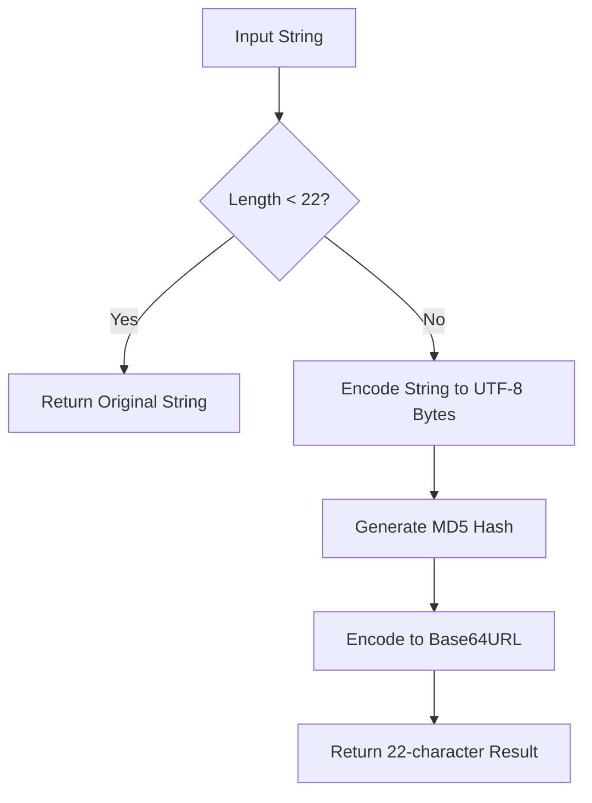
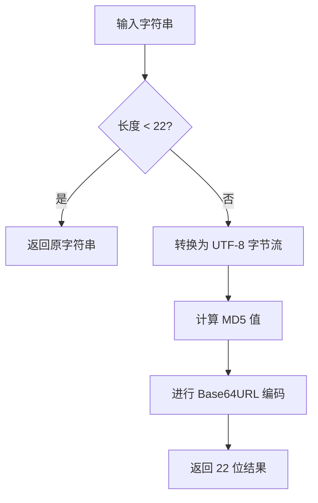

[English](#en) | [中文](#zh)

---

<a id="en"></a>

# @3-/strhash : Preserve short strings and hash long strings to 22-character base64url MD5

[Features](#features) | [Installation](#installation) | [Usage](#usage) | [Design Idea](#design-idea) | [Tech Stack](#tech-stack) | [Directory Structure](#directory-structure) | [Historical Background](#historical-background)

## Features

This package provides a utility to handle string hashing with size limits.
If string length is less than 22 characters, the original string returns.
If string length is 22 characters or more, it generates a 22-character base64url MD5 hash.
This ensures output string length never exceeds 22 characters, which is ideal for key generation, database indexing, and identifier normalization.

## Installation

```bash
bun add @3-/strhash
```

## Usage

```javascript
import strHash from "@3-/strhash";

// Short strings (length < 22) are preserved
console.log(strHash("hello")); // "hello"

// Long strings (length >= 22) are hashed to 22 characters
console.log(strHash("1234567890123456789012")); // "t_O8W6GepO1i9x2K1WjWfw"
```

## Design Idea

The utility compresses inputs exceeding the length limit while leaving shorter inputs readable.



## Tech Stack

- **Runtime**: Bun
- **Language**: JavaScript (ES modules)
- **Dependencies**:
  - `@3-/utf8`: For UTF-8 byte encoding
  - `@3-/base64url`: For base64url encoding and MD5 generation

## Directory Structure

```
.
├── build.sh         # Build script using mise
├── package.json     # Project configuration
├── run.sh           # Test runner and builder script
├── src
│   └── lib.js       # Core implementation source code
├── tests
│   └── lib.test.js  # Bun test suite
```

## Historical Background

### The Origin of MD5

In 1991, Professor Ronald Rivest from MIT designed the Message-Digest Algorithm 5 (MD5) as a secure replacement for MD4. Over the following decades, researchers discovered cryptographic vulnerabilities, making MD5 unsuitable for security-sensitive purposes. However, due to its speed, 128-bit fixed output length, and low collision rates, it remains a standard choice for non-cryptographic checksums and data partitioning.

### The Rise of Base64url

Standard Base64 encoding utilizes characters such as `+`, `/`, and `=`, which require percent-encoding in URL contexts or cause folder structure issues in file paths. To address these problems, the IETF standardized Base64url in RFC 4648 (October 2006), substituting `+` with `-`, `/` with `_`, and omitting the padding `=` characters. Today, Base64url serves as the backbone of modern web technologies like JSON Web Tokens (JWT).

---

<a id="zh"></a>

# @3-/strhash : 保留短字符串并哈希长字符串为22位base64url MD5

[功能介绍](#功能介绍) | [安装方法](#安装方法) | [使用演示](#使用演示) | [设计思路](#设计思路) | [技术堆栈](#技术堆栈) | [目录结构](#目录结构) | [历史背景](#历史背景)

## 功能介绍

提供限制字符串长度的哈希工具。
输入字符串长度小于 22 时，直接返回原字符串。
输入字符串长度大于等于 22 时，通过 MD5 计算并进行 base64url 编码，生成 22 位哈希值。
输出字符长度上限固定为 22，适用于生成数据库主键、索引以及标识符规范化。

## 安装方法

```bash
bun add @3-/strhash
```

## 使用演示

```javascript
import strHash from "@3-/strhash";

// 短字符串（长度小于 22）直接返回
console.log(strHash("hello")); // "hello"

// 长字符串（长度大于等于 22）被哈希为 22 位字符
console.log(strHash("1234567890123456789012")); // "t_O8W6GepO1i9x2K1WjWfw"
```

## 设计思路

本工具针对超出长度限制的输入进行压缩，同时保留短输入的原始可读性。



## 技术堆栈

- **运行环境**：Bun
- **开发语言**：JavaScript (ES Modules)
- **依赖库**：
  - `@3-/utf8`：用于 UTF-8 字节编码
  - `@3-/base64url`：用于 MD5 计算及 Base64url 编码

## 目录结构

```
.
├── build.sh         # 使用 mise 的构建脚本
├── package.json     # 项目配置文件
├── run.sh           # 构建与测试执行脚本
├── src
│   └── lib.js       # 核心实现源码
├── tests
│   └── lib.test.js  # Bun 测试套件
```

## 历史背景

### MD5 算法的诞生

1991年，麻省理工学院（MIT）教授 Ronald Rivest 设计了 MD5（Message-Digest Algorithm 5）算法，用以替代存在安全隐患的 MD4。尽管随着密码学研究发展，MD5 被证实存在碰撞漏洞而不适用于安全加密场景，但凭借出色的计算速度、固定的 128 位输出以及低碰撞率，MD5 在非加密校验和数据分片场景中依旧被广泛采用。

### Base64url 的普及

传统 Base64 编码中使用的 `+`、`/` 和 `=` 字符，在 URL 传输时需要进行百分号编码，且在文件路径中容易引起混淆。为解决此问题，IETF 在 2006 年 10 月发布的 RFC 4648 中定义了 Base64url 编码，将 `+` 替换为 `-`，`/` 替换为 `_`，并省略末尾占位的 `=`。如今，Base64url 已经成为 JSON Web Token（JWT）等主流 Web 规范的基础底座。

---

## About

This project is an open-source component of [i18n.site ⋅ Internationalization Solution](https://i18n.site).

- [i18 : MarkDown Command Line Translation Tool](https://i18n.site/i18)

  The translation perfectly maintains the Markdown format.

  It recognizes file changes and only translates the modified files.

  The translated Markdown content is editable; if you modify the original text and translate it again, manually edited translations will not be overwritten (as long as the original text has not been changed).

- [i18n.site : MarkDown Multi-language Static Site Generator](https://i18n.site/i18n.site)

  Optimized for a better reading experience

## 关于

本项目为 [i18n.site ⋅ 国际化解决方案](https://i18n.site) 的开源组件。

- [i18 : MarkDown命令行翻译工具](https://i18n.site/i18)

  翻译能够完美保持 Markdown 的格式。能识别文件的修改，仅翻译有变动的文件。

  Markdown 翻译内容可编辑；如果你修改原文并再次机器翻译，手动修改过的翻译不会被覆盖（如果这段原文没有被修改）。

- [i18n.site : MarkDown多语言静态站点生成器](https://i18n.site/i18n.site) 为阅读体验而优化。
