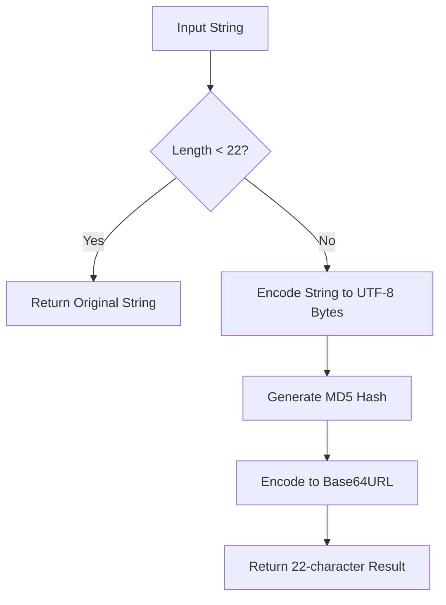

# @3-/strhash : Preserve short strings and hash long strings to 22-character base64url MD5

[Features](#features) | [Installation](#installation) | [Usage](#usage) | [Design Idea](#design-idea) | [Tech Stack](#tech-stack) | [Directory Structure](#directory-structure) | [Historical Background](#historical-background)

## Features

This package provides a utility to handle string hashing with size limits.
If string length is less than 22 characters, the original string returns.
If string length is 22 characters or more, it generates a 22-character base64url MD5 hash.
This ensures output string length never exceeds 22 characters, which is ideal for key generation, database indexing, and identifier normalization.

## Installation

```bash
bun add @3-/strhash
```

## Usage

```javascript
import strHash from "@3-/strhash";

// Short strings (length < 22) are preserved
console.log(strHash("hello")); // "hello"

// Long strings (length >= 22) are hashed to 22 characters
console.log(strHash("1234567890123456789012")); // "t_O8W6GepO1i9x2K1WjWfw"
```

## Design Idea

The utility compresses inputs exceeding the length limit while leaving shorter inputs readable.



## Tech Stack

- **Runtime**: Bun
- **Language**: JavaScript (ES modules)
- **Dependencies**:
  - `@3-/utf8`: For UTF-8 byte encoding
  - `@3-/base64url`: For base64url encoding and MD5 generation

## Directory Structure

```
.
├── build.sh         # Build script using mise
├── package.json     # Project configuration
├── run.sh           # Test runner and builder script
├── src
│   └── lib.js       # Core implementation source code
├── tests
│   └── lib.test.js  # Bun test suite
```

## Historical Background

### The Origin of MD5

In 1991, Professor Ronald Rivest from MIT designed the Message-Digest Algorithm 5 (MD5) as a secure replacement for MD4. Over the following decades, researchers discovered cryptographic vulnerabilities, making MD5 unsuitable for security-sensitive purposes. However, due to its speed, 128-bit fixed output length, and low collision rates, it remains a standard choice for non-cryptographic checksums and data partitioning.

### The Rise of Base64url

Standard Base64 encoding utilizes characters such as `+`, `/`, and `=`, which require percent-encoding in URL contexts or cause folder structure issues in file paths. To address these problems, the IETF standardized Base64url in RFC 4648 (October 2006), substituting `+` with `-`, `/` with `_`, and omitting the padding `=` characters. Today, Base64url serves as the backbone of modern web technologies like JSON Web Tokens (JWT).
