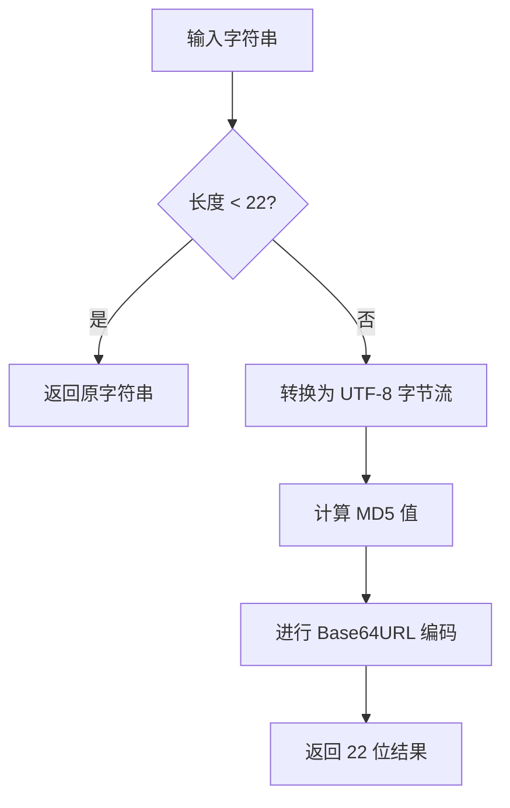

# @3-/strhash : 保留短字符串并哈希长字符串为22位base64url MD5

[功能介绍](#功能介绍) | [安装方法](#安装方法) | [使用演示](#使用演示) | [设计思路](#设计思路) | [技术堆栈](#技术堆栈) | [目录结构](#目录结构) | [历史背景](#历史背景)

## 功能介绍

提供限制字符串长度的哈希工具。
输入字符串长度小于 22 时，直接返回原字符串。
输入字符串长度大于等于 22 时，通过 MD5 计算并进行 base64url 编码，生成 22 位哈希值。
输出字符长度上限固定为 22，适用于生成数据库主键、索引以及标识符规范化。

## 安装方法

```bash
bun add @3-/strhash
```

## 使用演示

```javascript
import strHash from "@3-/strhash";

// 短字符串（长度小于 22）直接返回
console.log(strHash("hello")); // "hello"

// 长字符串（长度大于等于 22）被哈希为 22 位字符
console.log(strHash("1234567890123456789012")); // "t_O8W6GepO1i9x2K1WjWfw"
```

## 设计思路

本工具针对超出长度限制的输入进行压缩，同时保留短输入的原始可读性。



## 技术堆栈

- **运行环境**：Bun
- **开发语言**：JavaScript (ES Modules)
- **依赖库**：
  - `@3-/utf8`：用于 UTF-8 字节编码
  - `@3-/base64url`：用于 MD5 计算及 Base64url 编码

## 目录结构

```
.
├── build.sh         # 使用 mise 的构建脚本
├── package.json     # 项目配置文件
├── run.sh           # 构建与测试执行脚本
├── src
│   └── lib.js       # 核心实现源码
├── tests
│   └── lib.test.js  # Bun 测试套件
```

## 历史背景

### MD5 算法的诞生

1991年，麻省理工学院（MIT）教授 Ronald Rivest 设计了 MD5（Message-Digest Algorithm 5）算法，用以替代存在安全隐患的 MD4。尽管随着密码学研究发展，MD5 被证实存在碰撞漏洞而不适用于安全加密场景，但凭借出色的计算速度、固定的 128 位输出以及低碰撞率，MD5 在非加密校验和数据分片场景中依旧被广泛采用。

### Base64url 的普及

传统 Base64 编码中使用的 `+`、`/` 和 `=` 字符，在 URL 传输时需要进行百分号编码，且在文件路径中容易引起混淆。为解决此问题，IETF 在 2006 年 10 月发布的 RFC 4648 中定义了 Base64url 编码，将 `+` 替换为 `-`，`/` 替换为 `_`，并省略末尾占位的 `=`。如今，Base64url 已经成为 JSON Web Token（JWT）等主流 Web 规范的基础底座。
