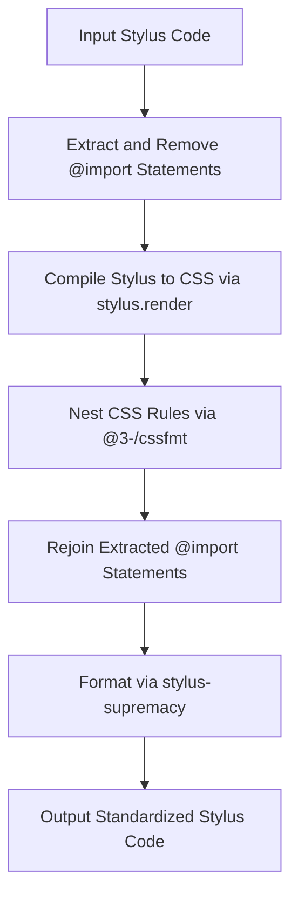
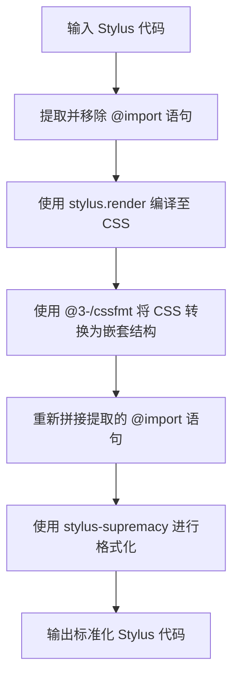

[English](#en) | [中文](#zh)

---

<a id="en"></a>

# @3-/stylfmt : Opinionated Stylus formatter based on CSS compilation and nesting

## Table of Contents

- [Introduction](#introduction)
- [Features](#features)
- [Tech Stack](#tech-stack)
- [Directory Structure](#directory-structure)
- [Design Architecture](#design-architecture)
- [Usage Demonstration](#usage-demonstration)
- [History Context](#history-context)

## Introduction

Stylus provides syntax flexibility. Syntax flexibility leads to inconsistent styles in codebase maintenance. This tool resolves style inconsistency by compiling Stylus to CSS, nesting rules, and formatting outputs with configuration.

## Features

- Extracts `@import` statements to prevent compile errors during isolation format processes.
- Compiles Stylus code to CSS to resolve mixins and variables.
- Nests CSS rules to restore hierarchy.
- Formats outputs with Stylus Supremacy configuration.

## Tech Stack

- **Stylus**: CSS preprocessor.
- **Stylus Supremacy**: Stylus formatting library.
- **@3-/cssfmt**: CSS nesting formatting tool.
- **Bun**: Runtime environment and test runner.

## Directory Structure

```text
.
├── lib/                     # Compiled files
├── src/                     # Source files
│   ├── lib.js               # Formatter core logic
│   └── parse.js             # Options parser
└── tests/                   # Test suite
    ├── lib.test.js          # Unit tests
    └── supremacy.yml        # Format options configuration
```

## Design Architecture

The formatting workflow executes through the following stages:



## Usage Demonstration

### Code Example

```javascript
import stylfmt from "@3-/stylfmt";

const format = stylfmt({
  insertColons: false,
  insertSemicolons: false,
  tabStopChar: "  ",
});

const code = `
body
  color: red
  background: blue
  a
    text-decoration: none
`;

const result = await format(code, "style.styl");
console.log(result);
```

## History Context

Stylus was created by TJ Holowaychuk in 2010 to offer CSS preprocessor functionality for Node.js. Its design allowed developers to omit braces, colons, and semicolons. While syntax flexibility enabled development speed, it introduced formatting challenges. Auto-formatters and compiler-assisted normalizers address these challenges to ensure style consistency.

---

<a id="zh"></a>

# @3-/stylfmt : 基于 CSS 编译与嵌套的 Stylus 格式化工具

## 目录

- [介绍](#介绍)
- [功能特性](#功能特性)
- [技术堆栈](#技术堆栈)
- [目录结构](#目录结构)
- [设计架构](#设计架构)
- [使用演示](#使用演示)
- [历史背景](#历史背景)

## 介绍

Stylus 提供语法灵活性。语法灵活性导致代码库维护中风格不一致。此工具通过编译 Stylus 至 CSS，进行嵌套规则转换，并结合配置进行格式化，解决风格不一致问题。

## 功能特性

- 提取并隔离 `@import` 语句，避免单文件格式化时发生编译错误。
- 编译 Stylus 代码至 CSS，解析混入（Mixins）与变量。
- 嵌套化 CSS 规则，重建样式层级。
- 采用 Stylus Supremacy 配置输出格式。

## 技术堆栈

- **Stylus**: CSS 预处理器。
- **Stylus Supremacy**: Stylus 格式化库。
- **@3-/cssfmt**: CSS 嵌套格式化工具。
- **Bun**: 运行时环境与测试运行器。

## 目录结构

```text
.
├── lib/                     # 编译后文件
├── src/                     # 源代码目录
│   ├── lib.js               # 格式化核心逻辑
│   └── parse.js             # 配置解析器
└── tests/                   # 测试用例目录
    ├── lib.test.js          # 单元测试
    └── supremacy.yml        # 格式化配置
```

## 设计架构

格式化流程包含以下步骤：



## 使用演示

### 代码示例

```javascript
import stylfmt from "@3-/stylfmt";

const format = stylfmt({
  insertColons: false,
  insertSemicolons: false,
  tabStopChar: "  ",
});

const code = `
body
  color: red
  background: blue
  a
    text-decoration: none
`;

const result = await format(code, "style.styl");
console.log(result);
```

## 历史背景

Stylus 由 TJ Holowaychuk 于 2010 年创建，旨在为 Node.js 生态提供 CSS 预处理器。其设计允许省略大括号、冒号与分号。虽然该设计提升了开发效率，但也带来了格式化与风格统一的难题。格式化工具通过编译辅助与规则校验解决这些难题，以确保代码风格一致性。

---

## About

This project is an open-source component of [i18n.site ⋅ Internationalization Solution](https://i18n.site).

- [i18 : MarkDown Command Line Translation Tool](https://i18n.site/i18)

  The translation perfectly maintains the Markdown format.

  It recognizes file changes and only translates the modified files.

  The translated Markdown content is editable; if you modify the original text and translate it again, manually edited translations will not be overwritten (as long as the original text has not been changed).

- [i18n.site : MarkDown Multi-language Static Site Generator](https://i18n.site/i18n.site)

  Optimized for a better reading experience

## 关于

本项目为 [i18n.site ⋅ 国际化解决方案](https://i18n.site) 的开源组件。

- [i18 : MarkDown命令行翻译工具](https://i18n.site/i18)

  翻译能够完美保持 Markdown 的格式。能识别文件的修改，仅翻译有变动的文件。

  Markdown 翻译内容可编辑；如果你修改原文并再次机器翻译，手动修改过的翻译不会被覆盖（如果这段原文没有被修改）。

- [i18n.site : MarkDown多语言静态站点生成器](https://i18n.site/i18n.site) 为阅读体验而优化。
