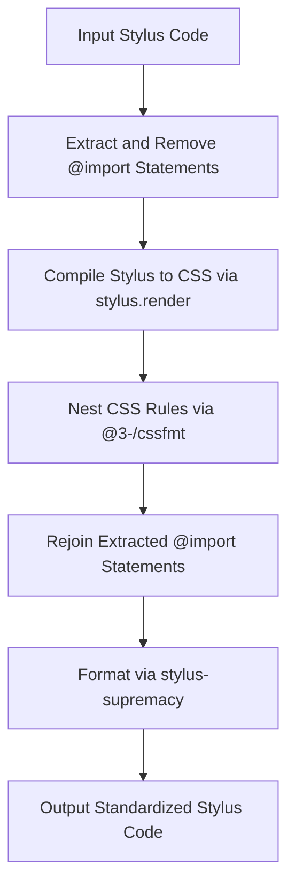

# @3-/stylfmt : Opinionated Stylus formatter based on CSS compilation and nesting

## Table of Contents

- [Introduction](#introduction)
- [Features](#features)
- [Tech Stack](#tech-stack)
- [Directory Structure](#directory-structure)
- [Design Architecture](#design-architecture)
- [Usage Demonstration](#usage-demonstration)
- [History Context](#history-context)

## Introduction

Stylus provides syntax flexibility. Syntax flexibility leads to inconsistent styles in codebase maintenance. This tool resolves style inconsistency by compiling Stylus to CSS, nesting rules, and formatting outputs with configuration.

## Features

- Extracts `@import` statements to prevent compile errors during isolation format processes.
- Compiles Stylus code to CSS to resolve mixins and variables.
- Nests CSS rules to restore hierarchy.
- Formats outputs with Stylus Supremacy configuration.

## Tech Stack

- **Stylus**: CSS preprocessor.
- **Stylus Supremacy**: Stylus formatting library.
- **@3-/cssfmt**: CSS nesting formatting tool.
- **Bun**: Runtime environment and test runner.

## Directory Structure

```text
.
├── lib/                     # Compiled files
├── src/                     # Source files
│   ├── lib.js               # Formatter core logic
│   └── parse.js             # Options parser
└── tests/                   # Test suite
    ├── lib.test.js          # Unit tests
    └── supremacy.yml        # Format options configuration
```

## Design Architecture

The formatting workflow executes through the following stages:



## Usage Demonstration

### Code Example

```javascript
import stylfmt from "@3-/stylfmt";

const format = stylfmt({
  insertColons: false,
  insertSemicolons: false,
  tabStopChar: "  ",
});

const code = `
body
  color: red
  background: blue
  a
    text-decoration: none
`;

const result = await format(code, "style.styl");
console.log(result);
```

## History Context

Stylus was created by TJ Holowaychuk in 2010 to offer CSS preprocessor functionality for Node.js. Its design allowed developers to omit braces, colons, and semicolons. While syntax flexibility enabled development speed, it introduced formatting challenges. Auto-formatters and compiler-assisted normalizers address these challenges to ensure style consistency.
