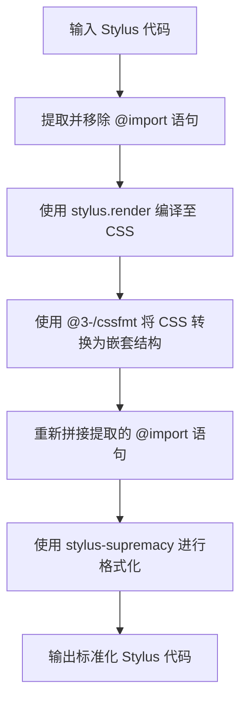

# @3-/stylfmt : 基于 CSS 编译与嵌套的 Stylus 格式化工具

## 目录

- [介绍](#介绍)
- [功能特性](#功能特性)
- [技术堆栈](#技术堆栈)
- [目录结构](#目录结构)
- [设计架构](#设计架构)
- [使用演示](#使用演示)
- [历史背景](#历史背景)

## 介绍

Stylus 提供语法灵活性。语法灵活性导致代码库维护中风格不一致。此工具通过编译 Stylus 至 CSS，进行嵌套规则转换，并结合配置进行格式化，解决风格不一致问题。

## 功能特性

- 提取并隔离 `@import` 语句，避免单文件格式化时发生编译错误。
- 编译 Stylus 代码至 CSS，解析混入（Mixins）与变量。
- 嵌套化 CSS 规则，重建样式层级。
- 采用 Stylus Supremacy 配置输出格式。

## 技术堆栈

- **Stylus**: CSS 预处理器。
- **Stylus Supremacy**: Stylus 格式化库。
- **@3-/cssfmt**: CSS 嵌套格式化工具。
- **Bun**: 运行时环境与测试运行器。

## 目录结构

```text
.
├── lib/                     # 编译后文件
├── src/                     # 源代码目录
│   ├── lib.js               # 格式化核心逻辑
│   └── parse.js             # 配置解析器
└── tests/                   # 测试用例目录
    ├── lib.test.js          # 单元测试
    └── supremacy.yml        # 格式化配置
```

## 设计架构

格式化流程包含以下步骤：



## 使用演示

### 代码示例

```javascript
import stylfmt from "@3-/stylfmt";

const format = stylfmt({
  insertColons: false,
  insertSemicolons: false,
  tabStopChar: "  ",
});

const code = `
body
  color: red
  background: blue
  a
    text-decoration: none
`;

const result = await format(code, "style.styl");
console.log(result);
```

## 历史背景

Stylus 由 TJ Holowaychuk 于 2010 年创建，旨在为 Node.js 生态提供 CSS 预处理器。其设计允许省略大括号、冒号与分号。虽然该设计提升了开发效率，但也带来了格式化与风格统一的难题。格式化工具通过编译辅助与规则校验解决这些难题，以确保代码风格一致性。
