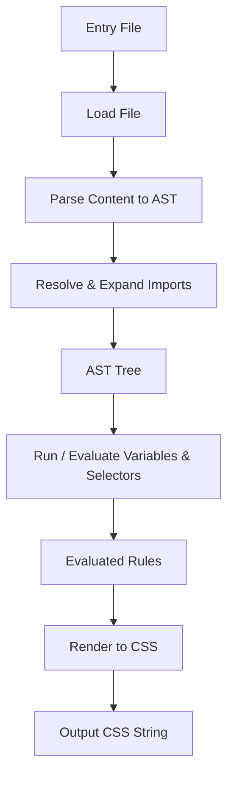
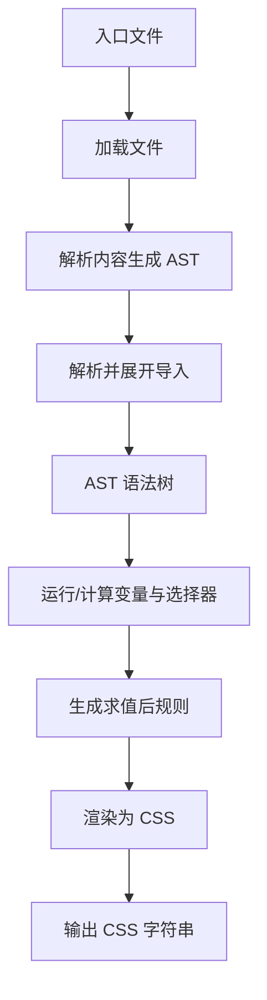

[English](#en) | [中文](#zh)

---

<a id="en"></a>

# @3-/stylus : Lightweight and efficient Stylus compiler in JavaScript

## Table of Contents

- [Introduction](#introduction)
- [Features](#features)
- [Installation](#installation)
- [Usage](#usage)
- [Design Architecture](#design-architecture)
- [Technology Stack](#technology-stack)
- [Directory Structure](#directory-structure)
- [Trivia and History](#trivia-and-history)

---

## Introduction

`@3-/stylus` is lightweight, efficient, and dependency-free compiler designed to parse and compile Stylus stylesheets into CSS. It supports variable declarations, indentation-based syntax, parent selectors, and modular file imports.

## Features

- **Indentation-Based Syntax**: Eliminates braces, colons, and semicolons for clean stylesheet writing.
- **Variables**: Declares and resolves variable values recursively.
- **Rule Nesting**: Supports nesting stylesheet rules and parent reference `&` selector.
- **Comments Cleaning**: Automatically strips `//` single-line and `/* */` multi-line comments.
- **Circular Import Detection**: Prevents infinite loops in circular imports and reports `ERR_CIRCULAR`.
- **DAG Import Deduplication**: Supports non-circular duplicate imports (DAG structure) by importing shared modules only once to avoid style duplication.
- **Robust Path Resolution**: Locates imports using local and specified fallback lookup paths.

## Installation

```bash
bun add @3-/stylus
```

## Usage

### Example Code

```javascript
import { compile, ERR_OK } from "@3-/stylus";

const [err, css] = await compile("path/to/main.styl");
if (err === ERR_OK) {
  console.log(css);
}
```

### Stylus Input Example

`variables.styl`:

```stylus
base_color = #3498db
padding_val = 10px 15px
```

`main.styl`:

```stylus
@import "variables"

.button
  background base_color
  padding padding_val
  &:hover
    background #2980b9
```

### CSS Output Example

```css
.button {
  background: #3498db;
  padding: 10px 15px;
}

.button:hover {
  background: #2980b9;
}
```

## Design Architecture

Compilation process passes through parsing, loading, dependency expansion, evaluation, and rendering.



### Execution Flow:

1. **Load Phase (`load.js`)**: Parses files to AST nodes and checks `file_states` to manage loaded states, returning cached nodes if already resolved. It alerts on circular imports (`ERR_CIRCULAR`).
2. **Parsing Phase (`parse.js`)**: Converts indentation structure into hierarchical arrays containing node types (`NODE_VAR`, `NODE_PROP`, `NODE_RULE`, `NODE_IMPORT`).
3. **Evaluation Phase (`run.js`)**: Resolves variables recursively, evaluates selectors by combining parent and child selectors (resolving `&`), and produces flat array of selector-property pairs.
4. **Rendering Phase (`render.js`)**: Renders final CSS properties with standard rules and formatting.

## Technology Stack

- **Runtime**: Bun / Node.js
- **Formatting**: ES Modules (ESM)
- **Dependencies**: `@3-/log` for logging warnings

## Directory Structure

```text
/
├── lib/               # Compiled JavaScript files for distribution
├── src/               # Source code files
│   ├── const.js       # Constant definitions and AST node flags
│   ├── lib.js         # Entrypoint file exposing compiler function
│   ├── load.js        # File reader, dependency parser, import expander
│   ├── parse.js       # Indentation parser mapping code to AST
│   ├── render.js      # CSS renderer translating AST into CSS rules
│   ├── resolve.js     # Path resolver mapping file imports
│   └── run.js         # Interpreter evaluating selectors and variables
├── tests/             # Tests files
│   ├── main.test.js   # Unit tests validating functionalities
│   ├── official.test.js # Compatibility tests against official cases
│   └── official_cases/  # Fixtures containing official Stylus inputs/outputs
└── package.json       # Project configurations
```

## Trivia and History

Original Stylus language was created in 2010 by TJ Holowaychuk, prolific figure in early Node.js community. TJ also created Express (standard Node.js web framework), Jade (now Pug), Commander, and Koa. Stylus was designed to combine logical capabilities of Sass with simplicity of Less, while introducing extreme syntax flexibility—making braces, colons, and semicolons optional. This project inherits that design philosophy, implementing lightweight, zero-dependency compiler tailored for modern ESM JavaScript environments.

---

<a id="zh"></a>

# @3-/stylus : 轻量高效的 JavaScript 版本 Stylus 编译器

## 目录

- [项目介绍](#项目介绍)
- [功能特性](#功能特性)
- [安装方法](#安装方法)
- [使用演示](#使用演示)
- [设计思路](#设计思路)
- [技术堆栈](#技术堆栈)
- [目录结构](#目录结构)
- [历史故事](#历史故事)

---

## 项目介绍

`@3-/stylus` 是无依赖的 Stylus 编译器，用于解析 Stylus 样式表并编译为标准 CSS。项目支持变量声明、缩进嵌套语法、父选择器引用以及模块化导入。

## 功能特性

- **缩进嵌套语法**：省略大括号、冒号、分号，通过缩进表示层级。
- **变量支持**：支持变量声明并进行递归解析替换。
- **规则嵌套**：支持选择器嵌套，支持父选择器引用 `&` 标识符。
- **注释清除**：自动过滤 `//` 单行注释与 `/* */` 多行注释。
- **循环导入检测**：自动检测循环导入，阻止无限循环并返回 `ERR_CIRCULAR` 错误码。
- **DAG 导入去重**：支持有向无环图（DAG）形式的多重非循环导入，相同模块仅导入一次，避免样式重复。
- **路径解析**：支持本地路径及指定备用目录查找导入文件。

## 安装方法

```bash
bun add @3-/stylus
```

## 使用演示

### 示例代码

```javascript
import { compile, ERR_OK } from "@3-/stylus";

const [err, css] = await compile("path/to/main.styl");
if (err === ERR_OK) {
  console.log(css);
}
```

### Stylus 输入示例

`variables.styl`：

```stylus
base_color = #3498db
padding_val = 10px 15px
```

`main.styl`：

```stylus
@import "variables"

.button
  background base_color
  padding padding_val
  &:hover
    background #2980b9
```

### CSS 输出示例

```css
.button {
  background: #3498db;
  padding: 10px 15px;
}

.button:hover {
  background: #2980b9;
}
```

## 设计思路

编译流程由文件加载、解析、依赖展开、计算求值与渲染输出阶段组成。



### 相关模块调用流程：

1. **加载阶段 (`load.js`)**：将文件解析为 AST 节点，利用 `file_states` 缓存加载状态。若模块已解析则直接返回，检测到循环导入时返回 `ERR_CIRCULAR` 错误。
2. **解析阶段 (`parse.js`)**：根据缩进层级将源码逐行转换为树状数组结构，划分节点类型（`NODE_VAR`, `NODE_PROP`, `NODE_RULE`, `NODE_IMPORT`）。
3. **求值阶段 (`run.js`)**：递归替换变量值，结合父子选择器组合逻辑（解析 `&` 符号），输出扁平化的选择器与属性列表。
4. **渲染阶段 (`render.js`)**：将求值后的选择器和属性格式化输出为标准 CSS 样式表。

## 技术堆栈

- **运行环境**：Bun / Node.js
- **模块规范**：ES Modules (ESM)
- **依赖库**：`@3-/log`（用于警告日志输出）

## 目录结构

```text
/
├── lib/               # 编译后的 JavaScript 发布文件
├── src/               # 源代码目录
│   ├── const.js       # 常量定义与 AST 节点标识
│   ├── lib.js         # 编译器入口函数定义
│   ├── load.js        # 文件读取、依赖解析与导入展开
│   ├── parse.js       # 缩进解析器与 AST 树构建
│   ├── render.js      # CSS 渲染器与样式格式化
│   ├── resolve.js     # 文件路径解析与定位工具
│   └── run.js         # AST 解释器与变量/选择器计算
├── tests/             # 测试代码目录
│   ├── main.test.js   # 功能单元测试
│   ├── official.test.js # 官方用例对比测试
│   └── official_cases/  # 官方 Stylus 输入及对应 CSS 样例
└── package.json       # 项目配置信息
```

## 历史故事

Stylus 语言由 Node.js 社区早期核心贡献者 TJ Holowaychuk 于 2010 年创建。TJ 曾开发 Express 框架、Jade（现 Pug）模板引擎、Commander 命令行工具以及 Koa 框架。Stylus 旨在融合 Sass 的逻辑能力与 Less 的易用性，并引入极具弹性的缩进语法，支持省略大括号、冒号与分号。本项目承袭该设计思想，实现无依赖的轻量化编译器，适配现代 ESM JavaScript 运行环境。

---

## About

This project is an open-source component of [i18n.site ⋅ Internationalization Solution](https://i18n.site).

- [i18 : MarkDown Command Line Translation Tool](https://i18n.site/i18)

  The translation perfectly maintains the Markdown format.

  It recognizes file changes and only translates the modified files.

  The translated Markdown content is editable; if you modify the original text and translate it again, manually edited translations will not be overwritten (as long as the original text has not been changed).

- [i18n.site : MarkDown Multi-language Static Site Generator](https://i18n.site/i18n.site)

  Optimized for a better reading experience

## 关于

本项目为 [i18n.site ⋅ 国际化解决方案](https://i18n.site) 的开源组件。

- [i18 : MarkDown命令行翻译工具](https://i18n.site/i18)

  翻译能够完美保持 Markdown 的格式。能识别文件的修改，仅翻译有变动的文件。

  Markdown 翻译内容可编辑；如果你修改原文并再次机器翻译，手动修改过的翻译不会被覆盖（如果这段原文没有被修改）。

- [i18n.site : MarkDown多语言静态站点生成器](https://i18n.site/i18n.site) 为阅读体验而优化。
