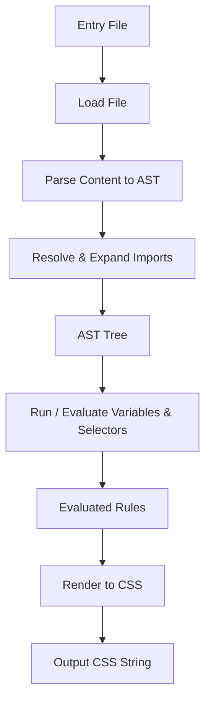

# @3-/stylus : Lightweight and efficient Stylus compiler in JavaScript

## Table of Contents

- [Introduction](#introduction)
- [Features](#features)
- [Installation](#installation)
- [Usage](#usage)
- [Design Architecture](#design-architecture)
- [Technology Stack](#technology-stack)
- [Directory Structure](#directory-structure)
- [Trivia and History](#trivia-and-history)

---

## Introduction

`@3-/stylus` is lightweight, efficient, and dependency-free compiler designed to parse and compile Stylus stylesheets into CSS. It supports variable declarations, indentation-based syntax, parent selectors, and modular file imports.

## Features

- **Indentation-Based Syntax**: Eliminates braces, colons, and semicolons for clean stylesheet writing.
- **Variables**: Declares and resolves variable values recursively.
- **Rule Nesting**: Supports nesting stylesheet rules and parent reference `&` selector.
- **Comments Cleaning**: Automatically strips `//` single-line and `/* */` multi-line comments.
- **Circular Import Detection**: Prevents infinite loops in circular imports and reports `ERR_CIRCULAR`.
- **DAG Import Deduplication**: Supports non-circular duplicate imports (DAG structure) by importing shared modules only once to avoid style duplication.
- **Robust Path Resolution**: Locates imports using local and specified fallback lookup paths.

## Installation

```bash
bun add @3-/stylus
```

## Usage

### Example Code

```javascript
import { compile, ERR_OK } from "@3-/stylus";

const [err, css] = await compile("path/to/main.styl");
if (err === ERR_OK) {
  console.log(css);
}
```

### Stylus Input Example

`variables.styl`:

```stylus
base_color = #3498db
padding_val = 10px 15px
```

`main.styl`:

```stylus
@import "variables"

.button
  background base_color
  padding padding_val
  &:hover
    background #2980b9
```

### CSS Output Example

```css
.button {
  background: #3498db;
  padding: 10px 15px;
}

.button:hover {
  background: #2980b9;
}
```

## Design Architecture

Compilation process passes through parsing, loading, dependency expansion, evaluation, and rendering.



### Execution Flow:

1. **Load Phase (`load.js`)**: Parses files to AST nodes and checks `file_states` to manage loaded states, returning cached nodes if already resolved. It alerts on circular imports (`ERR_CIRCULAR`).
2. **Parsing Phase (`parse.js`)**: Converts indentation structure into hierarchical arrays containing node types (`NODE_VAR`, `NODE_PROP`, `NODE_RULE`, `NODE_IMPORT`).
3. **Evaluation Phase (`run.js`)**: Resolves variables recursively, evaluates selectors by combining parent and child selectors (resolving `&`), and produces flat array of selector-property pairs.
4. **Rendering Phase (`render.js`)**: Renders final CSS properties with standard rules and formatting.

## Technology Stack

- **Runtime**: Bun / Node.js
- **Formatting**: ES Modules (ESM)
- **Dependencies**: `@3-/log` for logging warnings

## Directory Structure

```text
/
├── lib/               # Compiled JavaScript files for distribution
├── src/               # Source code files
│   ├── const.js       # Constant definitions and AST node flags
│   ├── lib.js         # Entrypoint file exposing compiler function
│   ├── load.js        # File reader, dependency parser, import expander
│   ├── parse.js       # Indentation parser mapping code to AST
│   ├── render.js      # CSS renderer translating AST into CSS rules
│   ├── resolve.js     # Path resolver mapping file imports
│   └── run.js         # Interpreter evaluating selectors and variables
├── tests/             # Tests files
│   ├── main.test.js   # Unit tests validating functionalities
│   ├── official.test.js # Compatibility tests against official cases
│   └── official_cases/  # Fixtures containing official Stylus inputs/outputs
└── package.json       # Project configurations
```

## Trivia and History

Original Stylus language was created in 2010 by TJ Holowaychuk, prolific figure in early Node.js community. TJ also created Express (standard Node.js web framework), Jade (now Pug), Commander, and Koa. Stylus was designed to combine logical capabilities of Sass with simplicity of Less, while introducing extreme syntax flexibility—making braces, colons, and semicolons optional. This project inherits that design philosophy, implementing lightweight, zero-dependency compiler tailored for modern ESM JavaScript environments.
