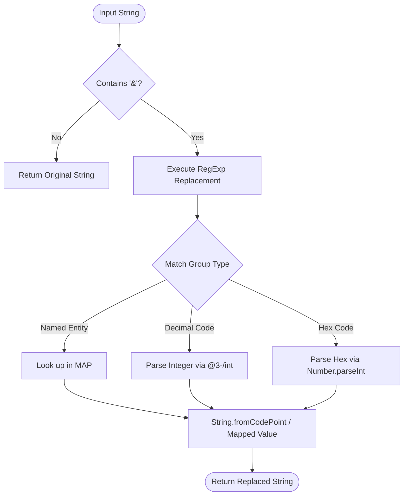
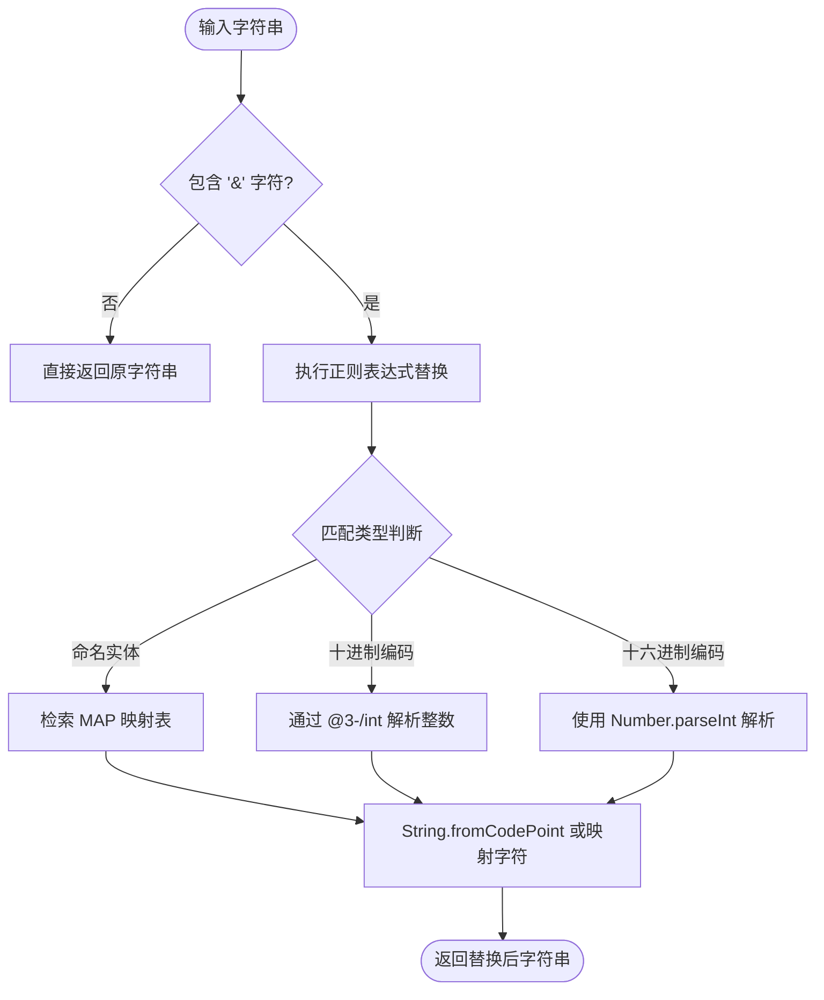

[English](#en) | [中文](#zh)

---

<a id="en"></a>

# @3-/unescape : Fast and Lightweight HTML Entity Unescape Utility

## Table of Contents

- [Introduction](#introduction)
- [Features](#features)
- [Usage](#usage)
- [Calling Flow](#calling-flow)
- [Tech Stack](#tech-stack)
- [Directory Structure](#directory-structure)
- [History](#history)

## Introduction

Provides unescaping functionality for HTML entities. Converts named, decimal, and hexadecimal character entity references back to standard characters.

## Features

- Named entities lookup support (`&amp;`, `&lt;`, `&gt;`, `&quot;`, `&apos;`).
- Decimal character references support (`&#65;`).
- Hexadecimal character references support (`&#x41;`).
- Safe execution avoiding unnecessary processing when no ampersand exists.

## Usage

Demonstrated in [tests/lib.test.js](file:///Users/z/i18n/lib/unescape/tests/lib.test.js):

```javascript
import unescape from "../src/lib.js";

// Named entities
unescape("&amp; &lt; &gt; &quot; &apos;"); // Returns: & < > " '

// Numeric entities (decimal and hexadecimal)
unescape("&#65; &#x41; &#X41;"); // Returns: A A A

// Strings without entities
unescape("normal text"); // Returns: normal text
```

## Calling Flow

Module calling flow for unescaping processes:



## Tech Stack

- **Runtime**: [Bun](https://bun.sh)
- **Language**: JavaScript (ES modules)
- **External Dependency**: [@3-/int](https://www.npmjs.com/package/@3-/int) (For integer parsing optimization)

## Directory Structure

Detailed directory structure layout:

- [src/lib.js](file:///Users/z/i18n/lib/unescape/src/lib.js) - Core unescaping implementation.
- [tests/lib.test.js](file:///Users/z/i18n/lib/unescape/tests/lib.test.js) - Test suite and usage demonstration.
- [package.json](file:///Users/z/i18n/lib/unescape/package.json) - Project manifest.

## History

HTML character entities originated from SGML (Standard Generalized Markup Language) in the 1980s (ISO 8879:1986). In SGML, these were defined as "character entity references". Tim Berners-Lee adopted SGML syntax when designing HTML in 1991 to bypass character display limitations of early computer terminals and encode reserved symbols like `<` and `>`. Over time, the HTML5 specification expanded the list of named character entities to over 2000. In modern applications, Unicode has minimized the necessity for named entities, yet core XML/HTML entities remain essential for processing web markup and preventing syntax injection.

---

<a id="zh"></a>

# @3-/unescape : 轻量高效的 HTML 实体字符反转义工具

## 目录导航

- [功能介绍](#功能介绍)
- [功能特性](#功能特性)
- [使用演示](#使用演示)
- [设计思路与调用流程](#设计思路与调用流程)
- [技术堆栈](#技术堆栈)
- [目录结构](#目录结构)
- [历史背景](#历史背景)

## 功能介绍

提供 HTML 实体字符反转义功能，将命名实体、十进制和十六进制字符实体引用恢复为原始字符。

## 功能特性

- 支持命名实体解析（`&amp;`、`&lt;`、`&gt;`、`&quot;`、`&apos;`）。
- 支持十进制数字实体解析（`&#65;`）。
- 支持十六进制数字实体解析（`&#x41;`）。
- 具备快速判断机制，字符串不含 `&` 时直接返回，避免无用正则匹配。

## 使用演示

演示代码参见 [tests/lib.test.js](file:///Users/z/i18n/lib/unescape/tests/lib.test.js)：

```javascript
import unescape from "../src/lib.js";

// 命名实体解析
unescape("&amp; &lt; &gt; &quot; &apos;"); // 返回: & < > " '

// 数字实体解析 (十进制与十六进制)
unescape("&#65; &#x41; &#X41;"); // 返回: A A A

// 无实体字符
unescape("normal text"); // 返回: normal text
```

## 设计思路与调用流程

输入字符串经由以下流程进行反转义处理：



## 技术堆栈

- **运行时**: [Bun](https://bun.sh)
- **开发语言**: JavaScript (ES modules)
- **外部依赖**: [@3-/int](https://www.npmjs.com/package/@3-/int) (用于十进制整数解析优化)

## 目录结构

项目目录及文件分布：

- [src/lib.js](file:///Users/z/i18n/lib/unescape/src/lib.js) - 核心反转义逻辑实现。
- [tests/lib.test.js](file:///Users/z/i18n/lib/unescape/tests/lib.test.js) - 测试用例及调用演示。
- [package.json](file:///Users/z/i18n/lib/unescape/package.json) - 项目配置文件。

## 历史背景

HTML 实体字符（Entity References）可追溯至 20 世纪 80 年代制定的 SGML（标准通用标记语言，ISO 8879:1986）。当时称为“字符实体引用”。1991 年，Tim Berners-Lee 创立 HTML 时，沿用了 SGML 的实体引用设计，以解决早期终端设备无法显示特定非 ASCII 字符以及避免 `<` 和 `>` 产生标签解析歧义的问题。随着 HTML4 及 HTML5 标准发布，命名实体库扩充至 2000 余种。在 Unicode 普及的今天，虽然命名实体的日常使用频次有所降低，但在网页标记处理与防注入安全防护中，基本的 HTML 实体转义与反转义依然是核心基础。

---

## About

This project is an open-source component of [i18n.site ⋅ Internationalization Solution](https://i18n.site).

- [i18 : MarkDown Command Line Translation Tool](https://i18n.site/i18)

  The translation perfectly maintains the Markdown format.

  It recognizes file changes and only translates the modified files.

  The translated Markdown content is editable; if you modify the original text and translate it again, manually edited translations will not be overwritten (as long as the original text has not been changed).

- [i18n.site : MarkDown Multi-language Static Site Generator](https://i18n.site/i18n.site)

  Optimized for a better reading experience

## 关于

本项目为 [i18n.site ⋅ 国际化解决方案](https://i18n.site) 的开源组件。

- [i18 : MarkDown命令行翻译工具](https://i18n.site/i18)

  翻译能够完美保持 Markdown 的格式。能识别文件的修改，仅翻译有变动的文件。

  Markdown 翻译内容可编辑；如果你修改原文并再次机器翻译，手动修改过的翻译不会被覆盖（如果这段原文没有被修改）。

- [i18n.site : MarkDown多语言静态站点生成器](https://i18n.site/i18n.site) 为阅读体验而优化。
