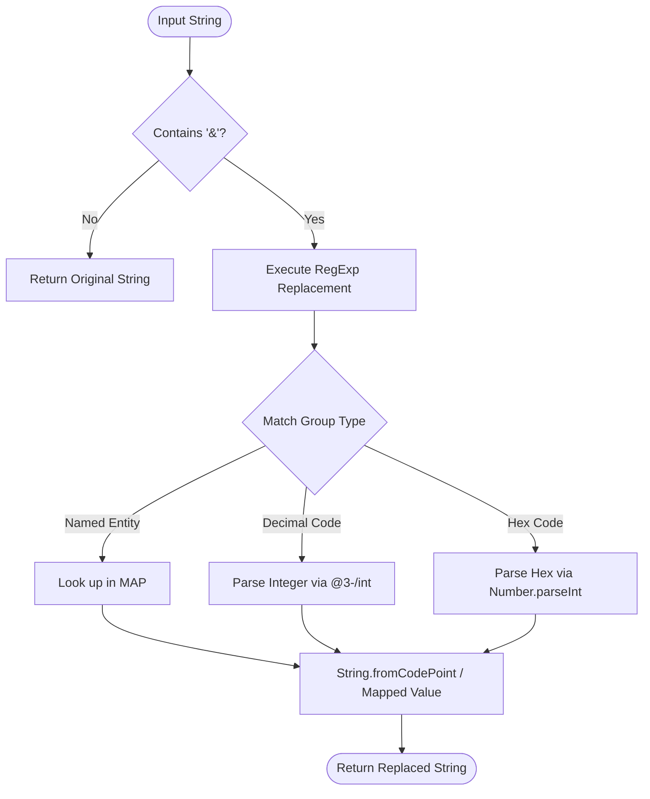

# @3-/unescape : Fast and Lightweight HTML Entity Unescape Utility

## Table of Contents

- [Introduction](#introduction)
- [Features](#features)
- [Usage](#usage)
- [Calling Flow](#calling-flow)
- [Tech Stack](#tech-stack)
- [Directory Structure](#directory-structure)
- [History](#history)

## Introduction

Provides unescaping functionality for HTML entities. Converts named, decimal, and hexadecimal character entity references back to standard characters.

## Features

- Named entities lookup support (`&amp;`, `&lt;`, `&gt;`, `&quot;`, `&apos;`).
- Decimal character references support (`&#65;`).
- Hexadecimal character references support (`&#x41;`).
- Safe execution avoiding unnecessary processing when no ampersand exists.

## Usage

Demonstrated in [tests/lib.test.js](file:///Users/z/i18n/lib/unescape/tests/lib.test.js):

```javascript
import unescape from "../src/lib.js";

// Named entities
unescape("&amp; &lt; &gt; &quot; &apos;"); // Returns: & < > " '

// Numeric entities (decimal and hexadecimal)
unescape("&#65; &#x41; &#X41;"); // Returns: A A A

// Strings without entities
unescape("normal text"); // Returns: normal text
```

## Calling Flow

Module calling flow for unescaping processes:



## Tech Stack

- **Runtime**: [Bun](https://bun.sh)
- **Language**: JavaScript (ES modules)
- **External Dependency**: [@3-/int](https://www.npmjs.com/package/@3-/int) (For integer parsing optimization)

## Directory Structure

Detailed directory structure layout:

- [src/lib.js](file:///Users/z/i18n/lib/unescape/src/lib.js) - Core unescaping implementation.
- [tests/lib.test.js](file:///Users/z/i18n/lib/unescape/tests/lib.test.js) - Test suite and usage demonstration.
- [package.json](file:///Users/z/i18n/lib/unescape/package.json) - Project manifest.

## History

HTML character entities originated from SGML (Standard Generalized Markup Language) in the 1980s (ISO 8879:1986). In SGML, these were defined as "character entity references". Tim Berners-Lee adopted SGML syntax when designing HTML in 1991 to bypass character display limitations of early computer terminals and encode reserved symbols like `<` and `>`. Over time, the HTML5 specification expanded the list of named character entities to over 2000. In modern applications, Unicode has minimized the necessity for named entities, yet core XML/HTML entities remain essential for processing web markup and preventing syntax injection.
