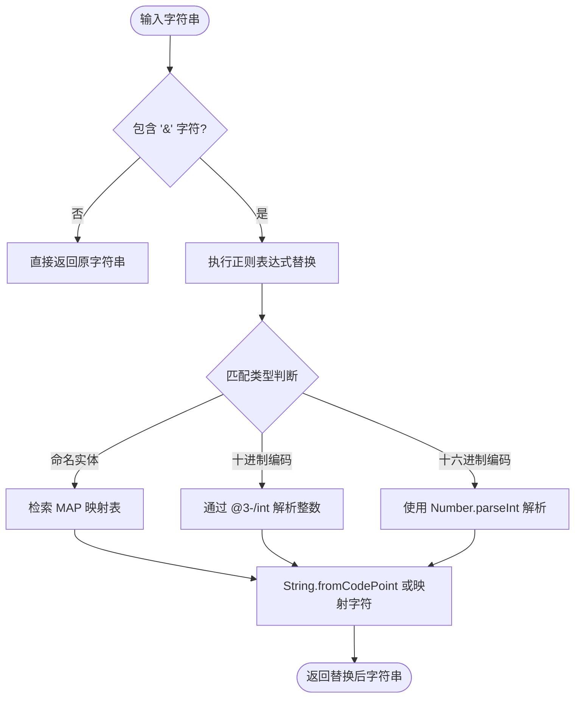

# @3-/unescape : 轻量高效的 HTML 实体字符反转义工具

## 目录导航

- [功能介绍](#功能介绍)
- [功能特性](#功能特性)
- [使用演示](#使用演示)
- [设计思路与调用流程](#设计思路与调用流程)
- [技术堆栈](#技术堆栈)
- [目录结构](#目录结构)
- [历史背景](#历史背景)

## 功能介绍

提供 HTML 实体字符反转义功能，将命名实体、十进制和十六进制字符实体引用恢复为原始字符。

## 功能特性

- 支持命名实体解析（`&amp;`、`&lt;`、`&gt;`、`&quot;`、`&apos;`）。
- 支持十进制数字实体解析（`&#65;`）。
- 支持十六进制数字实体解析（`&#x41;`）。
- 具备快速判断机制，字符串不含 `&` 时直接返回，避免无用正则匹配。

## 使用演示

演示代码参见 [tests/lib.test.js](file:///Users/z/i18n/lib/unescape/tests/lib.test.js)：

```javascript
import unescape from "../src/lib.js";

// 命名实体解析
unescape("&amp; &lt; &gt; &quot; &apos;"); // 返回: & < > " '

// 数字实体解析 (十进制与十六进制)
unescape("&#65; &#x41; &#X41;"); // 返回: A A A

// 无实体字符
unescape("normal text"); // 返回: normal text
```

## 设计思路与调用流程

输入字符串经由以下流程进行反转义处理：



## 技术堆栈

- **运行时**: [Bun](https://bun.sh)
- **开发语言**: JavaScript (ES modules)
- **外部依赖**: [@3-/int](https://www.npmjs.com/package/@3-/int) (用于十进制整数解析优化)

## 目录结构

项目目录及文件分布：

- [src/lib.js](file:///Users/z/i18n/lib/unescape/src/lib.js) - 核心反转义逻辑实现。
- [tests/lib.test.js](file:///Users/z/i18n/lib/unescape/tests/lib.test.js) - 测试用例及调用演示。
- [package.json](file:///Users/z/i18n/lib/unescape/package.json) - 项目配置文件。

## 历史背景

HTML 实体字符（Entity References）可追溯至 20 世纪 80 年代制定的 SGML（标准通用标记语言，ISO 8879:1986）。当时称为“字符实体引用”。1991 年，Tim Berners-Lee 创立 HTML 时，沿用了 SGML 的实体引用设计，以解决早期终端设备无法显示特定非 ASCII 字符以及避免 `<` 和 `>` 产生标签解析歧义的问题。随着 HTML4 及 HTML5 标准发布，命名实体库扩充至 2000 余种。在 Unicode 普及的今天，虽然命名实体的日常使用频次有所降低，但在网页标记处理与防注入安全防护中，基本的 HTML 实体转义与反转义依然是核心基础。
